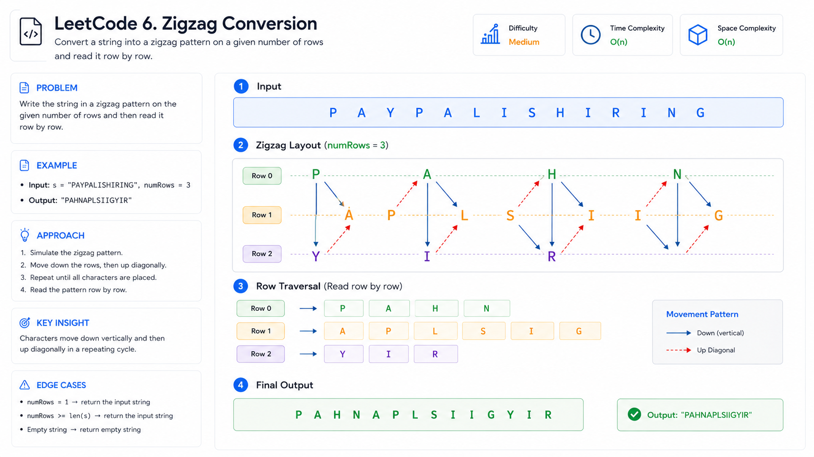
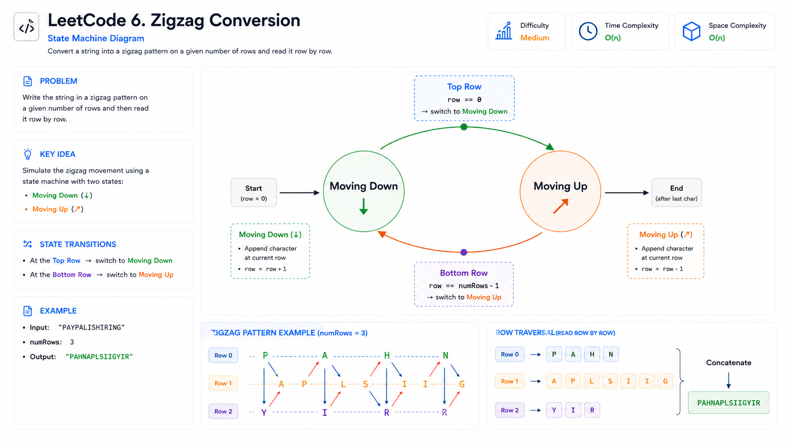
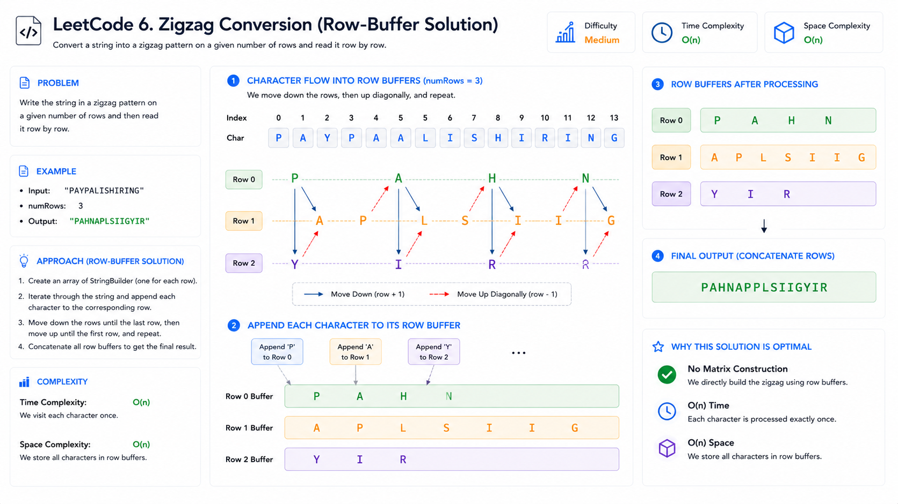
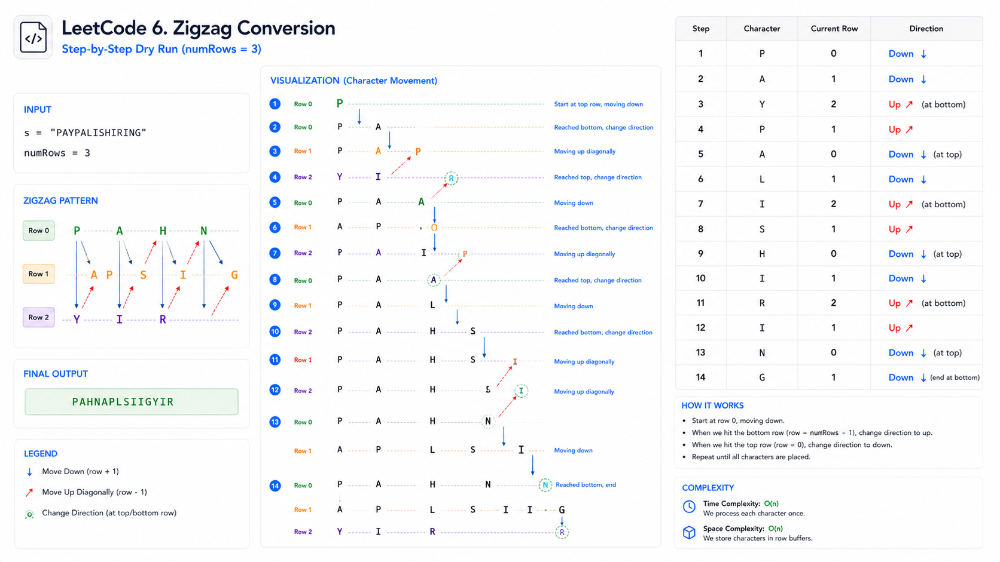
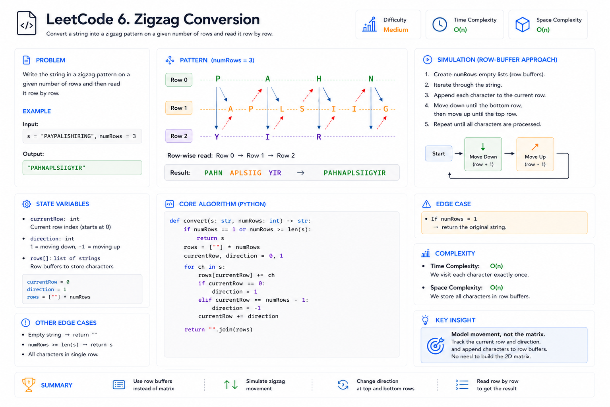

# Zigzag Conversion (#6) — Cheat Sheet

## Visual Overview



## State Machine



## Row Buffer Approach



## Dry Run Visualization



## Interview Summary




## Pattern Summary

### Primary Pattern
Simulation

### Secondary Pattern
String Manipulation

### Difficulty
Medium

### Core Idea

Simulate movement through rows instead of constructing the entire zigzag matrix.

Track:

```text
currentRow
direction
rows[]
```

When reaching:

```text
Top Row    → move DOWN
Bottom Row → move UP
```

Append characters into row buffers and concatenate all rows at the end.

---

# Recognition Signals

You are likely dealing with a Simulation problem when the statement contains:

### Visual Movement

Examples:

```text
Move up
Move down
Move left
Move right
Traverse
Follow pattern
```

---

### Direction Changes

Examples:

```text
Reverse direction
Bounce
Alternate movement
Oscillate
```

---

### Layout Transformation

Examples:

```text
Arrange characters
Convert pattern
Reorder based on movement
```

---

### State Tracking

Need to maintain:

```text
Position
Direction
Current state
```

---

# Pattern Template

## Generic Simulation Template

```text
Initialize state

For each element:

    Process current state

    If boundary reached:
        Change direction/state

    Move to next position

Return result
```

---

## Zigzag Conversion Template

```text
Create row buffers

currentRow = 0
direction = DOWN

For each character:

    Add character to current row

    If top row:
        direction = DOWN

    If bottom row:
        direction = UP

    currentRow += direction

Combine all rows
```

---

# Key Formula

## Cycle Length

For mathematical solutions:

```text
cycleLength = 2 × numRows − 2
```

Example:

```text
numRows = 4

cycleLength = 6
```

Pattern:

```text
0
1
2
3
2
1
0
1
2
3
...
```

---

## Row Movement Formula

Simulation version:

```text
currentRow += direction
```

Where:

```text
DOWN = +1
UP   = -1
```

---

# Complexity Cheatsheet

## Brute Force Matrix

| Metric | Value |
|----------|--------|
| Time | O(n) |
| Space | O(n + matrix) |

Problems:

- Wasteful memory
- Complex implementation

---

## Row Buffer Simulation (Recommended)

| Metric | Value |
|----------|--------|
| Time | O(n) |
| Space | O(n) |

Benefits:

- Easy to understand
- Easy to explain
- Interview friendly

---

## Mathematical Cycle Approach

| Metric | Value |
|----------|--------|
| Time | O(n) |
| Space | O(n) |

Benefits:

- Interesting alternative

Drawbacks:

- Harder implementation
- Lower readability

---

# Recognition Flowchart

```text
Visual Pattern?
      │
      ▼
Character Movement?
      │
      ▼
Direction Changes?
      │
      ▼
Track State Instead
Of Building Structure
      │
      ▼
Simulation Pattern
```

---

# Common Pitfalls

## Forgetting numRows == 1

Wrong:

```text
Run zigzag logic
```

Correct:

```text
Return original string
```

Reason:

No zigzag exists.

---

## Switching Direction Too Late

Wrong:

```text
Move beyond boundary
Then reverse
```

Correct:

```text
Reverse immediately
At top/bottom row
```

---

## Building Full Matrix

Avoid:

```text
char[][]
```

Usually unnecessary.

---

## Off-by-One Errors

Common bugs:

```text
currentRow = -1
currentRow = numRows
```

Always validate boundary transitions.

---

# Similar Problems

## LeetCode

### #54 Spiral Matrix

Pattern:

Simulation

Track:

```text
Direction
Boundaries
```

---

### #59 Spiral Matrix II

Pattern:

Simulation

Fill matrix following movement rules.

---

### #498 Diagonal Traverse

Pattern:

Simulation

Track:

```text
Position
Direction
```

---

### #885 Spiral Matrix III

Pattern:

Simulation

Path generation.

---

### #874 Walking Robot Simulation

Pattern:

Simulation

State transitions and movement.

---

### #151 Reverse Words in a String

Pattern:

String Manipulation

Focus on transformation without extra structure.

---

# Interview Quick Answer

If asked:

### "What is the optimal solution?"

Answer:

> Use row-buffer simulation. Maintain the current row and movement direction. Append each character to its row. Reverse direction when reaching the top or bottom row. Finally concatenate all rows.

Complexity:

```text
Time  : O(n)
Space : O(n)
```

---

# 30-Second Revision

### Problem Type

```text
Simulation
```

---

### State Variables

```text
currentRow
direction
rows[]
```

---

### Boundary Rules

```text
Top Row    → go down
Bottom Row → go up
```

---

### Important Edge Case

```text
numRows == 1
```

Return original string.

---

### Complexity

```text
Time  : O(n)
Space : O(n)
```

---

### Key Insight

```text
Do not build the zigzag matrix.

Store only row contents.
```

---

# One-Line Memory Hook

> Zigzag Conversion = Simulate row movement with a direction flag and concatenate row buffers.