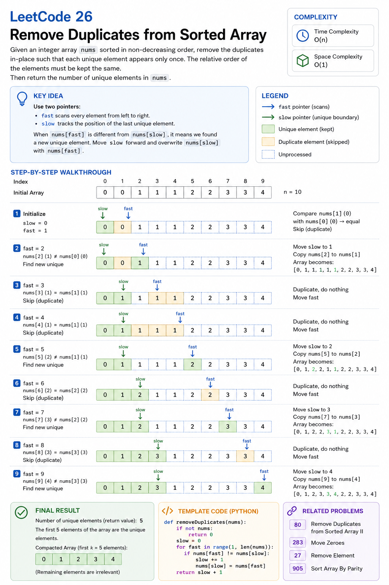

# Cheat Sheet — Remove Duplicates from Sorted Array (LeetCode 26)

---



# Pattern Summary

### Pattern

```text
Two Pointers
(Fast Pointer + Slow Pointer)
```

### Core Idea

Use:

```text
fast  → scans the array
slow  → marks end of unique region
```

When a new unique value is found:

```text
slow++
nums[slow] = nums[fast]
```

The first part of the array always contains unique elements.

---

# Recognition Signals

Look for these clues in a problem statement:

### Signal 1

```text
Sorted Array
```

### Signal 2

```text
Remove Duplicates
```

### Signal 3

```text
Modify In-Place
```

### Signal 4

```text
O(1) Extra Space
```

### Signal 5

```text
Return Length
```

When these signals appear together:

```text
Sorted Array
+
Deduplication
+
In-Place
```

Think:

```text
Two Pointers
```

immediately.

---

# Key Formula

### Pointer Update Rule

```text
if nums[fast] != nums[slow]
{
    slow++
    nums[slow] = nums[fast]
}
```

---

### Final Answer

```text
return slow + 1
```

Because:

```text
slow = last valid index
```

and

```text
length = index + 1
```

---

# Visual Template

## Initial

```text
[1,1,2,2,3]

 S
 F
```

---

## After Finding New Unique

```text
[1,2,2,2,3]

   S
     F
```

---

## Final

```text
[1,2,3,_,_]

     S
```

Unique region:

```text
nums[0...slow]
```

---

# Invariant

Always remember:

```text
nums[0...slow]
```

contains all unique elements discovered so far.

This invariant is the key correctness argument.

---

# Algorithm Template

```text
if array is empty
    return 0

slow = 0

for fast from 1 to n-1

    if nums[fast] != nums[slow]

        slow++
        nums[slow] = nums[fast]

return slow + 1
```

---

# Complexity Cheatsheet

| Metric | Complexity |
|----------|----------|
| Time | O(n) |
| Space | O(1) |

### Why?

Fast pointer visits every element exactly once.

```text
n comparisons
```

No auxiliary data structure is used.

---

# Common Pitfalls

### Pitfall 1

Returning:

```text
slow
```

instead of:

```text
slow + 1
```

---

### Pitfall 2

Starting with:

```text
fast = 0
```

Correct:

```text
fast = 1
```

---

### Pitfall 3

Forgetting empty array handling.

Incorrect:

```text
nums[0]
```

when array length is zero.

---

### Pitfall 4

Using extra structures:

```text
HashSet
HashMap
ArrayList
```

Violates O(1) space requirement.

---

### Pitfall 5

Re-sorting the array.

Input is already sorted.

No need for:

```text
O(n log n)
```

sorting.

---

# Similar Problems

## Same Pattern

| Problem | Difficulty |
|----------|----------|
| LeetCode 27 — Remove Element | Easy |
| LeetCode 80 — Remove Duplicates from Sorted Array II | Medium |
| LeetCode 283 — Move Zeroes | Easy |
| LeetCode 977 — Squares of a Sorted Array | Easy |
| LeetCode 344 — Reverse String | Easy |

---

## Pattern Family

```text
Two Pointers
```

Common applications:

- Array Compaction
- Duplicate Removal
- Partitioning
- Sliding Operations
- In-Place Transformations

---

# Interview Quick Notes

### Observation

```text
Sorted array
⇒ duplicates are adjacent
```

---

### Goal

```text
Keep one copy of each value.
```

---

### Strategy

```text
Read Pointer
+
Write Pointer
```

---

### Invariant

```text
nums[0...slow]
```

contains unique values.

---

### Optimal Complexity

```text
Time  : O(n)
Space : O(1)
```

---

# Engineering Insight

This problem demonstrates a powerful production pattern:

```text
Read Stream
    ↓
Filter Duplicates
    ↓
Write Compact Data
```

The same concept appears in:

- Log processing
- ETL pipelines
- Data compaction
- Storage engines
- Stream processing systems

---

# One-Minute Revision

### If You Remember Only Five Things

1.

```text
Array is sorted.
```

2.

```text
Duplicates are adjacent.
```

3.

```text
Use Fast + Slow pointers.
```

4.

```text
Write only when a new unique value appears.
```

5.

```text
Return slow + 1.
```

---

# Pattern Memory Hook

```text
Sorted Array
+
Remove Duplicates
+
O(1) Space
=
Two Pointers
```

This is the canonical introduction to the Fast & Slow Pointer pattern for arrays.