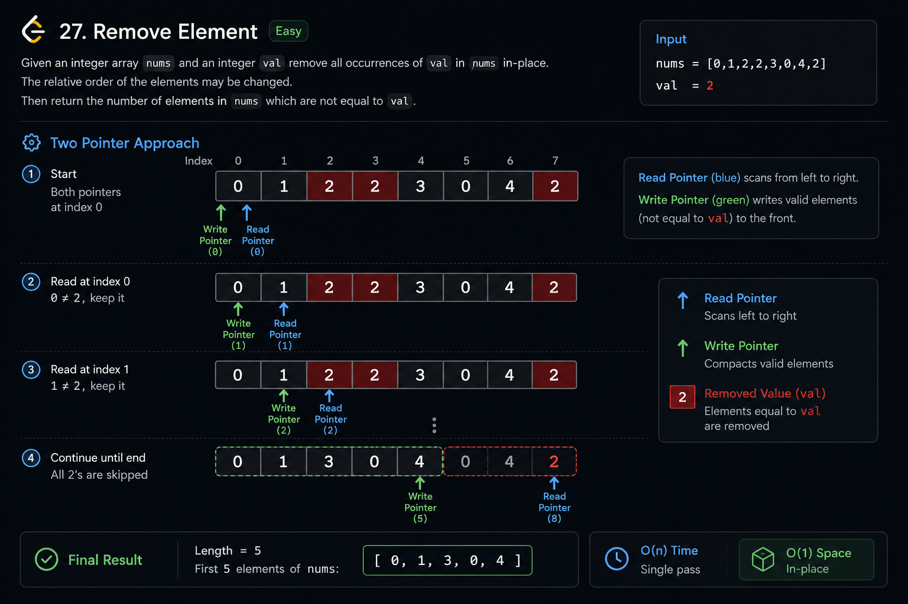
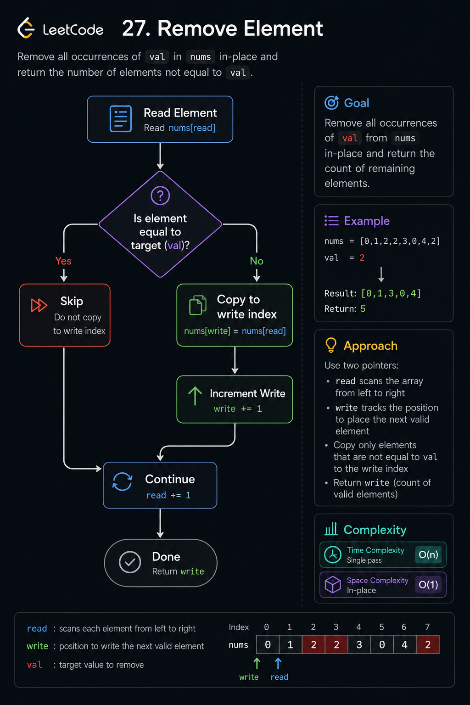
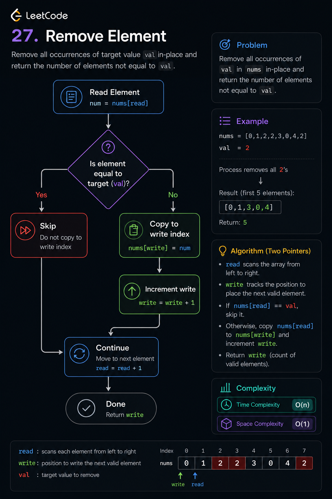
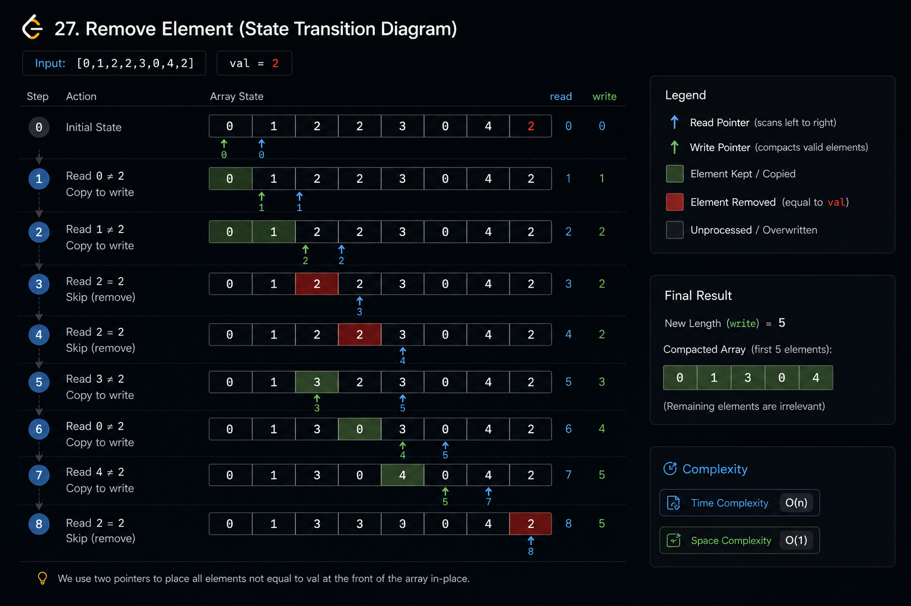

# Remove Element

## Visual Explanation









## Problem Statement

Given an integer array `nums` and an integer `val`, remove all occurrences of `val` in-place.

The relative order of the elements may be changed.

Return the number of elements in `nums` that are not equal to `val`.

The first `k` elements of `nums` should contain the remaining elements after removal.

### Example 1

```text
Input:
nums = [3,2,2,3]
val = 3

Output:
2

nums = [2,2,_,_]
```

### Example 2

```text
Input:
nums = [0,1,2,2,3,0,4,2]
val = 2

Output:
5

nums = [0,1,4,0,3,_,_,_]
```

---

## Difficulty

**Easy**

---

## Tags

* Array
* Two Pointers
* In-Place Modification

---

## Pattern

### Primary Pattern

Two Pointers

### Secondary Pattern

In-Place Array Filtering

---

## Intuition

The goal is not to physically delete elements from the array.

Instead:

* Keep track of where the next valid element should be placed.
* Traverse the array once.
* Whenever an element is not equal to `val`, copy it into the next available position.

This effectively compacts all valid elements toward the front of the array.

---

## Key Observation

We only care about the first `k` positions after removal.

Therefore:

* Read pointer scans every element.
* Write pointer tracks where the next valid element should go.

Every non-target value is copied to the write position.

---

## Brute Force Approach

### Idea

Create a new array.

* Traverse the original array.
* Store only elements not equal to `val`.
* Copy them back if necessary.

### Algorithm

1. Create a temporary list.
2. Iterate through `nums`.
3. Add elements that are not equal to `val`.
4. Return the size of the temporary list.

### Complexity

| Metric | Complexity |
| ------ | ---------- |
| Time   | O(n)       |
| Space  | O(n)       |

### Limitations

* Uses extra memory.
* Violates the in-place requirement.
* Not acceptable for interview expectations.

---

## Optimized Approach

### Two Pointer In-Place Filtering

Maintain:

* `read` → scans the array
* `write` → stores next valid position

Whenever:

```text
nums[read] != val
```

Copy:

```text
nums[write] = nums[read]
write++
```

After traversal:

```text
write = count of remaining elements
```

Return `write`.

---

### Algorithm

```text
Initialize write = 0

For each element in nums:
    If current element != val:
        nums[write] = current element
        write++

Return write
```

---

### Why It Works

Every valid element is moved exactly once.

The write pointer always points to the first unused valid position.

After processing:

```text
[valid elements][garbage values]
```

Only the valid portion matters.

The first `write` elements contain the answer.

---

### Complexity

| Metric | Complexity |
| ------ | ---------- |
| Time   | O(n)       |
| Space  | O(1)       |

---

## Edge Cases

### Empty Array

```text
nums = []
val = 1

Output = 0
```

---

### Single Element Removed

```text
nums = [5]
val = 5

Output = 0
```

---

### Single Element Kept

```text
nums = [5]
val = 3

Output = 1
```

---

### All Elements Removed

```text
nums = [2,2,2]

val = 2

Output = 0
```

---

### No Elements Removed

```text
nums = [1,3,5]

val = 2

Output = 3
```

---

### Duplicate Values

```text
nums = [4,1,4,2,4]

val = 4

Output = 2
```

---

### Negative Values

```text
nums = [-1,-2,-1]

val = -1

Output = 1
```

---

### Large Input

```text
Length = 100000

Time Complexity remains O(n)
Space Complexity remains O(1)
```

---

## Dry Run

### Input

```text
nums = [0,1,2,2,3,0,4,2]
val = 2
```

| Step | Read Index | Value | Action | Write Index | Array State       |
| ---- | ---------- | ----- | ------ | ----------- | ----------------- |
| 1    | 0          | 0     | Keep   | 1           | [0,1,2,2,3,0,4,2] |
| 2    | 1          | 1     | Keep   | 2           | [0,1,2,2,3,0,4,2] |
| 3    | 2          | 2     | Skip   | 2           | [0,1,2,2,3,0,4,2] |
| 4    | 3          | 2     | Skip   | 2           | [0,1,2,2,3,0,4,2] |
| 5    | 4          | 3     | Move   | 3           | [0,1,3,2,3,0,4,2] |
| 6    | 5          | 0     | Move   | 4           | [0,1,3,0,3,0,4,2] |
| 7    | 6          | 4     | Move   | 5           | [0,1,3,0,4,0,4,2] |
| 8    | 7          | 2     | Skip   | 5           | [0,1,3,0,4,0,4,2] |

Result:

```text
k = 5

First 5 elements:
[0,1,3,0,4]
```

---

## Common Mistakes

### Returning Array Instead of Length

Wrong:

```text
return nums
```

Correct:

```text
return k
```

---

### Using Extra Array

```text
temp = []
```

This violates the in-place requirement.

---

### Incrementing Write Pointer Incorrectly

Wrong:

```text
write++
even when value == val
```

Only increment after writing a valid element.

---

### Confusing Read and Write Indices

The read pointer scans.

The write pointer modifies.

Keep their responsibilities separate.

---

## Interview Discussion

Interviewers often ask:

1. Why is this O(1) space?
2. Why don't we need actual deletion?
3. Can order be preserved?
4. What changes if order doesn't matter?
5. Can we reduce writes?

A strong candidate explains that the array is simply being compacted in-place.

---

## Follow-up Questions

### Follow-up 1

Can you solve it without preserving order?

Answer:

Use left and right pointers and swap unwanted values with the end.

---

### Follow-up 2

How many writes occur?

At most:

```text
Number of valid elements
```

---

### Follow-up 3

Can this pattern be reused?

Yes.

Common filtering problems use the same technique.

---

## Real World Applications

### Data Cleaning

Remove invalid records from datasets.

---

### Log Processing

Filter unwanted log entries.

---

### Stream Processing

Retain only matching events.

---

### Database Operations

Compact valid rows before bulk insertion.

---

### Memory Optimization

Perform transformations without allocating new memory.

---

## Related Problems

| Problem                                         | Pattern            |
| ----------------------------------------------- | ------------------ |
| Two Sum (1)                                     | Hash Map           |
| Remove Duplicates from Sorted Array (26)        | Two Pointers       |
| Move Zeroes (283)                               | Two Pointers       |
| Sort Array By Parity (905)                      | Two Pointers       |
| Remove Duplicates from Sorted Array II (80)     | Two Pointers       |
| Partition Array According to Given Pivot (2161) | Array Manipulation |
