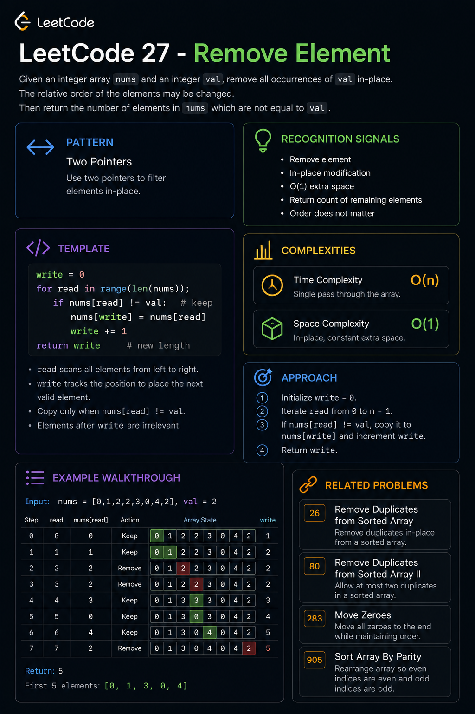

# Remove Element (LeetCode 27) — One Page Revision

---



# Pattern Summary

### Pattern

**Two Pointers (Read-Write Pointer / Array Compaction)**

Core idea:

```text
Read Everything
Write Only What You Keep
```

One pointer scans the array.

Another pointer builds the valid result in-place.

---

# Recognition Signals

When you see phrases like:

```text
Remove element

Modify in-place

O(1) extra space

Return new length

Do not allocate another array
```

Think:

✅ Two Pointers

✅ Array Compaction

✅ In-Place Filtering

---

# Core Idea

Given:

```text
nums = [0,1,2,2,3,0,4,2]
val = 2
```

Keep:

```text
0,1,3,0,4
```

Remove:

```text
2,2,2
```

Result:

```text
[0,1,3,0,4]
```

---

# Visual Model

```text
Read Pointer
     ↓
[0,1,2,2,3,0,4,2]

Write Pointer
↓
[ ]
```

Every valid element gets copied forward.

---

# Universal Template

```text
write = 0

for each element:
    if element should be kept:
        nums[write] = element
        write++

return write
```

---

# Code Template (Language Independent)

```text
write = 0

for read = 0 → n-1:
    if nums[read] != target:
        nums[write] = nums[read]
        write++

return write
```

---

# Complexity Cheatsheet

| Metric       | Value       |
| ------------ | ----------- |
| Time         | O(n)        |
| Space        | O(1)        |
| Traversal    | Single Pass |
| Stable Order | Yes         |
| Extra Memory | No          |

---

# Why It Works

The write pointer always points to:

```text
Next valid insertion position
```

Every kept value is copied exactly once.

After traversal:

```text
[Valid Elements][Garbage]
```

Only the valid section matters.

---

# Dry Memory Trick

Remember:

```text
Read = Search

Write = Store
```

or

```text
Read scans

Write builds
```

---

# Example Walkthrough

Input:

```text
nums = [3,2,2,3]
val = 3
```

Process:

```text
Read 3 → Skip

Read 2 → Write

Read 2 → Write

Read 3 → Skip
```

Result:

```text
[2,2]
```

Return:

```text
2
```

---

# Common Mistakes

## Mistake #1

Using extra array.

```text
temp = []
```

❌ O(n) space

---

## Mistake #2

Returning array.

```text
return nums
```

❌ Wrong

Return:

```text
k
```

---

## Mistake #3

Incrementing write every iteration.

Wrong:

```text
write++
```

Correct:

```text
Only after keeping an element
```

---

## Mistake #4

Thinking array must shrink.

LeetCode only checks:

```text
First k positions
```

The rest can contain anything.

---

# Interview Answer (30 Seconds)

> "I'll use a read pointer to scan every element and a write pointer to track where the next valid element should go. Whenever the current value isn't equal to the target value, I'll copy it to the write position and advance write. This filters the array in-place with O(n) time and O(1) extra space."

---

# Follow-Up Optimization

### If Order Does NOT Matter

Use:

```text
Swap with last element
```

Example:

```text
[3,2,2,3]
```

↓

```text
[2,2]
```

Benefits:

```text
Potentially fewer writes
```

Tradeoff:

```text
Order lost
```

---

# Similar Problems

| Problem                                    | Pattern            |
| ------------------------------------------ | ------------------ |
| 26. Remove Duplicates from Sorted Array    | Two Pointers       |
| 80. Remove Duplicates from Sorted Array II | Two Pointers       |
| 283. Move Zeroes                           | Two Pointers       |
| 905. Sort Array By Parity                  | Two Pointers       |
| 1089. Duplicate Zeros                      | Array Manipulation |

---

# Pattern Family

```text
Array Filtering
        │
        ▼
Read-Write Pointer Pattern
        │
 ┌──────┼──────┐
 ▼      ▼      ▼
27     26     283
```

---

# Interview Takeaway

```text
If the problem says:

Remove
Filter
Compact
In-Place

→ Think Read Pointer + Write Pointer
```

### Golden Formula

```text
Read Everything
Write Only What You Keep
```

This is the fundamental Array Compaction pattern used throughout Two Pointer interview questions.
