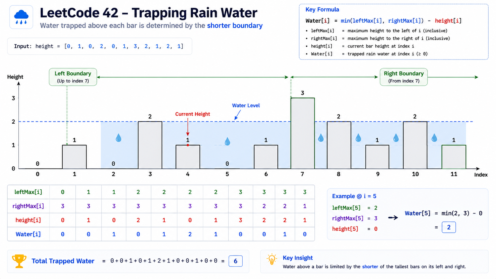
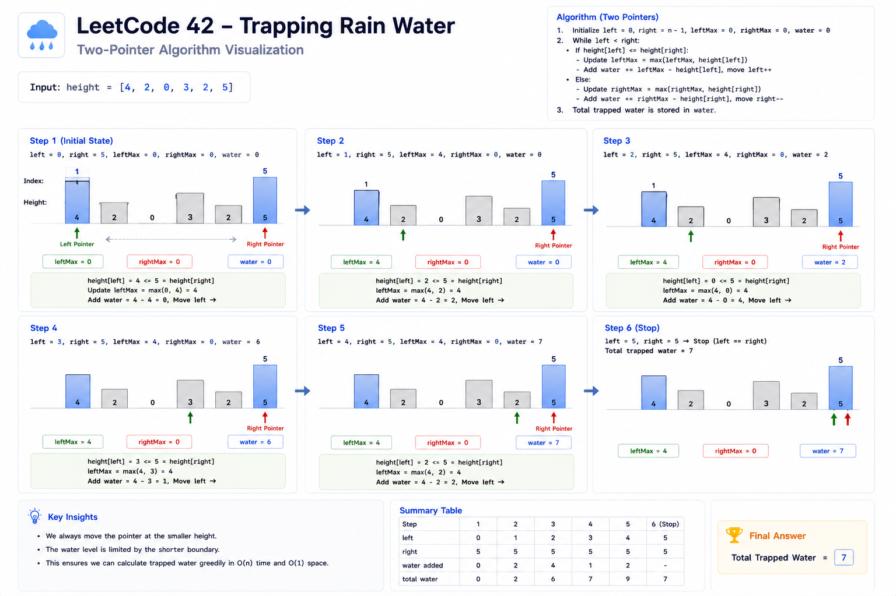
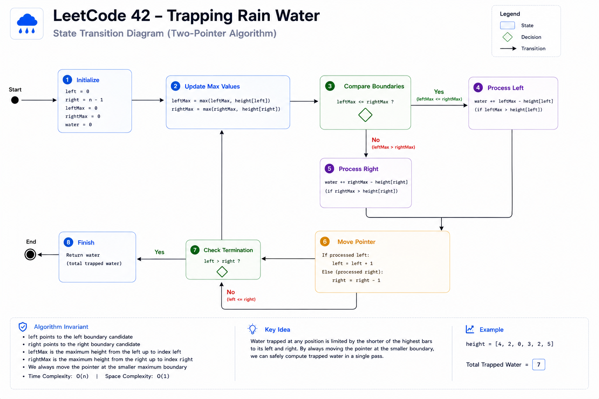
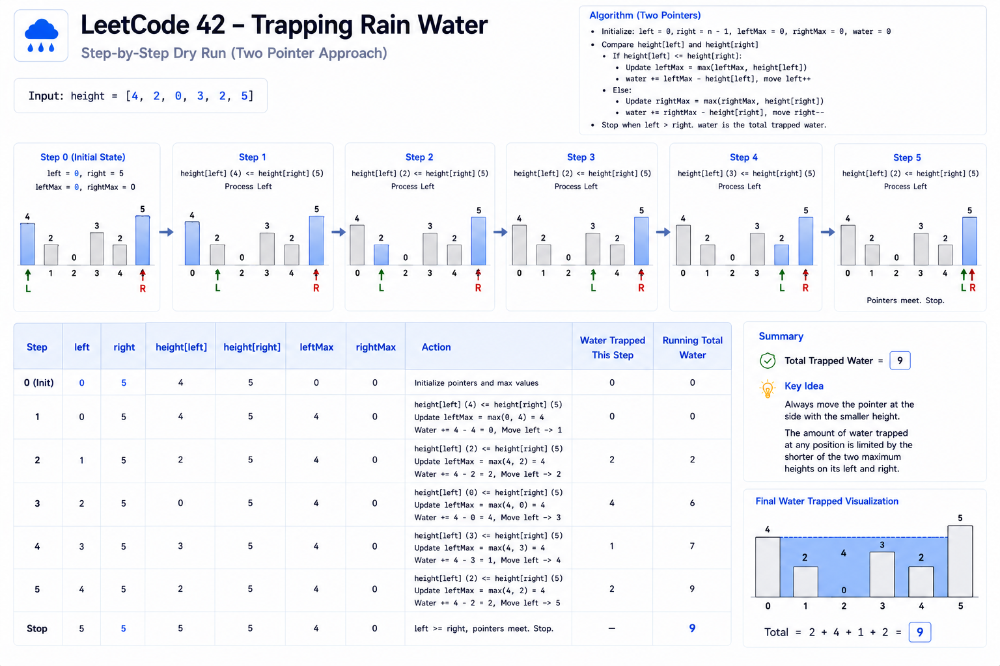

# Trapping Rain Water — Cheat Sheet

## Visual Overview



## Two Pointer Workflow



## State Transition Diagram



## Dry Run



## Pattern Summary

### Primary Pattern

```text
Two Pointers
```

### Secondary Patterns

```text
Prefix/Suffix Maximum
Dynamic Programming
Monotonic Stack
Space Optimization
```

### Difficulty

```text
Hard
```

### LeetCode

```text
42. Trapping Rain Water
```

---

# Recognition Signals

You should immediately think of this pattern when you see:

### Signal 1

```text
Need information from both
left and right sides.
```

---

### Signal 2

```text
Water trapped between bars,
walls, boundaries, or heights.
```

---

### Signal 3

```text
Find contribution at every index.
```

---

### Signal 4

```text
Need left maximum and
right maximum values.
```

---

### Signal 5

```text
Optimize O(n) extra memory
to O(1).
```

---

# Core Insight

For every position:

```text
water[i] =
min(leftMax, rightMax)
- height[i]
```

Water can only exist if:

```text
left boundary exists
AND
right boundary exists
```

---

# Key Formula

## Trapped Water at Index i

```text
water[i] =
min(leftMax[i], rightMax[i])
- height[i]
```

---

## Total Water

```text
totalWater =
Σ water[i]
```

---

# Why Minimum?

Incorrect:

```text
max(leftMax, rightMax)
```

Correct:

```text
min(leftMax, rightMax)
```

Reason:

```text
Water spills over
the shorter wall.
```

---

# Two Pointer Rule

Maintain:

```text
left
right

leftMax
rightMax
```

---

### Case 1

```text
leftMax < rightMax
```

Water level is determined by:

```text
leftMax
```

Process:

```text
left side
```

Move:

```text
left++
```

---

### Case 2

```text
rightMax <= leftMax
```

Water level is determined by:

```text
rightMax
```

Process:

```text
right side
```

Move:

```text
right--
```

---

# Template

## Optimal O(n) Solution

```text
left = 0
right = n - 1

leftMax = 0
rightMax = 0

water = 0

while left < right

    leftMax =
        max(leftMax, height[left])

    rightMax =
        max(rightMax, height[right])

    if leftMax < rightMax

        water +=
            leftMax - height[left]

        left++

    else

        water +=
            rightMax - height[right]

        right--

return water
```

---

# Complexity Cheatsheet

| Approach | Time | Space |
|-----------|--------|--------|
| Brute Force | O(n²) | O(1) |
| Prefix/Suffix Arrays | O(n) | O(n) |
| Monotonic Stack | O(n) | O(n) |
| Two Pointers | O(n) | O(1) |

---

# Optimization Journey

```text
Brute Force
    ↓
DP Arrays
    ↓
Two Pointers
```

---

## Stage 1

Brute Force:

```text
For every index

Find:
    leftMax
    rightMax
```

Cost:

```text
O(n²)
```

---

## Stage 2

Precompute:

```text
leftMax[]
rightMax[]
```

Cost:

```text
O(n)
```

Space:

```text
O(n)
```

---

## Stage 3

Store only:

```text
leftMax
rightMax
```

Cost:

```text
O(n)
```

Space:

```text
O(1)
```

---

# Dry Memory Trick

Imagine:

```text
Water is trapped by
the shorter wall.
```

Example:

```text
Wall = 4
Wall = 10
```

Water level:

```text
4
```

NOT:

```text
10
```

This instantly explains:

```text
min(leftMax, rightMax)
```

---

# Common Pitfalls

## Pitfall 1

Using:

```text
max(leftMax, rightMax)
```

instead of:

```text
min(...)
```

---

## Pitfall 2

Moving pointers before calculating water.

Correct order:

```text
Update max

Calculate water

Move pointer
```

---

## Pitfall 3

Forgetting small inputs.

```text
[]
[1]
[1,2]
```

Output:

```text
0
```

---

## Pitfall 4

Using O(n²) when interviewer expects optimization.

---

## Pitfall 5

Unable to justify pointer movement.

Remember:

```text
Smaller boundary
determines water level.
```

---

# Edge Cases Checklist

### Empty Array

```text
[]
```

Output:

```text
0
```

---

### Single Bar

```text
[5]
```

Output:

```text
0
```

---

### Two Bars

```text
[5,1]
```

Output:

```text
0
```

---

### Flat Surface

```text
[3,3,3]
```

Output:

```text
0
```

---

### Strictly Increasing

```text
[1,2,3,4,5]
```

Output:

```text
0
```

---

### Strictly Decreasing

```text
[5,4,3,2,1]
```

Output:

```text
0
```

---

### Deep Valley

```text
[5,0,5]
```

Output:

```text
5
```

---

# Similar Problems

## Same Pattern

### 11. Container With Most Water

Pattern:

```text
Two Pointers
```

---

### 167. Two Sum II

Pattern:

```text
Two Pointers
```

---

## Related Boundary Problems

### 84. Largest Rectangle in Histogram

Pattern:

```text
Monotonic Stack
```

---

### 739. Daily Temperatures

Pattern:

```text
Monotonic Stack
```

---

### 42. Trapping Rain Water

Pattern:

```text
Two Pointers
+
Boundary Analysis
```

---

### 407. Trapping Rain Water II

Pattern:

```text
Heap + BFS
```

---

# Interview One-Liner

If asked to summarize the solution:

> For each position, trapped water equals the difference between its height and the smaller of the tallest boundaries on both sides. Using two pointers, we dynamically maintain those boundaries and compute the answer in O(n) time and O(1) space.

---

# 30-Second Revision Notes

### Formula

```text
water[i] =
min(leftMax, rightMax)
- height[i]
```

### Key Insight

```text
Smaller boundary
controls water level.
```

### Optimal Pattern

```text
Two Pointers
```

### Time Complexity

```text
O(n)
```

### Space Complexity

```text
O(1)
```

### Pointer Rule

```text
leftMax < rightMax
    → process left

otherwise
    → process right
```

### Interview Goal

```text
Brute Force
    ↓
DP Arrays
    ↓
Two Pointers
```

Always explain the optimization journey.