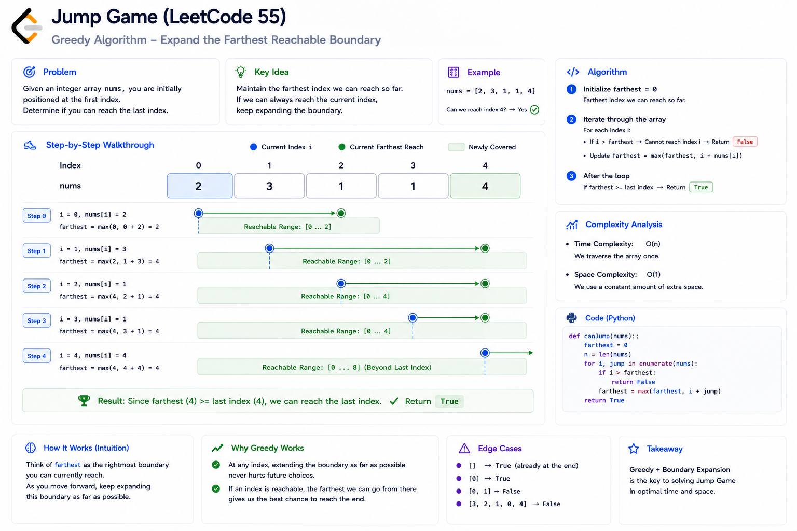
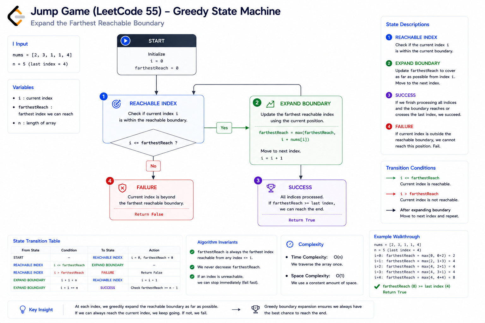
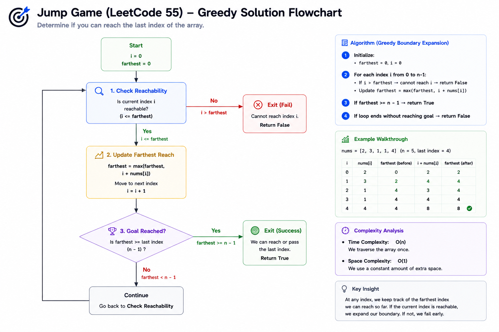
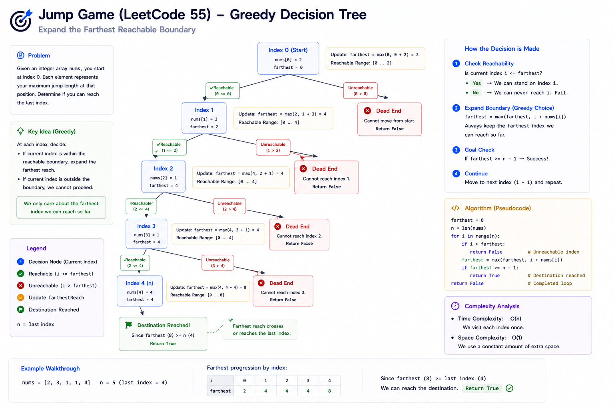
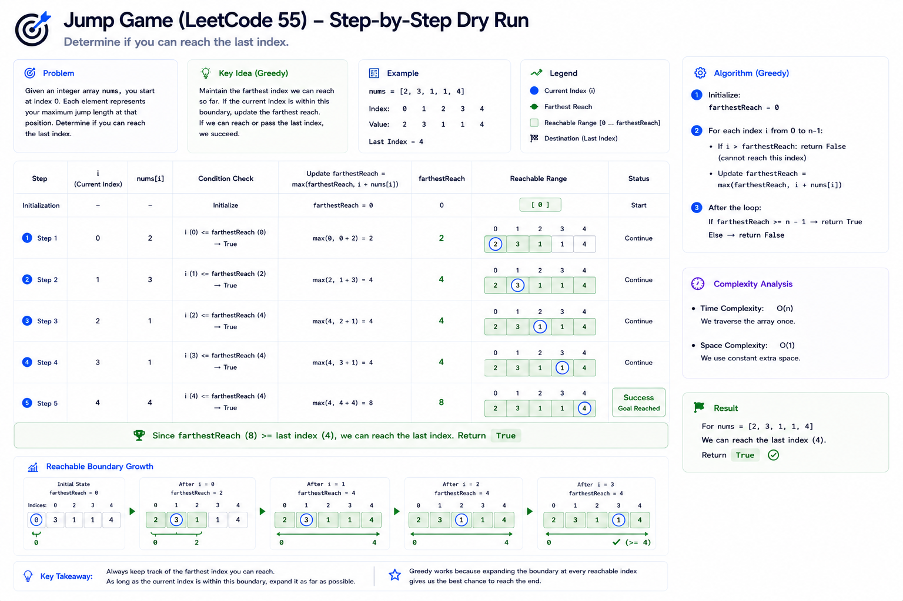

# Jump Game — Cheat Sheet

## Visual Explanation

### Reachability Expansion Diagram



### State Machine Diagram



### Flowchart Diagram



### Decision Tree Diagram



### Dry Run Visualization




## Pattern Summary

### Pattern

```text
Greedy
```

### Category

```text
Array Reachability
```

### Core Idea

Instead of exploring every jump:

```text
Where can I jump next?
```

Track only:

```text
What is the farthest index
I can currently reach?
```

If the current index is reachable, use it to extend the reachable range.

---

## Recognition Signals

Look for these clues in interviews:

### Signal 1

Problem asks:

```text
Can we reach the destination?
```

not:

```text
What path should we take?
```

---

### Signal 2

Each position provides:

```text
future reach
```

or

```text
movement capability
```

---

### Signal 3

You only need a:

```text
Yes / No
```

answer.

---

### Signal 4

The exact route does not matter.

Only reachability matters.

---

### Signal 5

The input is a linear structure:

```text
Array
```

where each element affects future positions.

---

## Key Formula

### Reachability Update

```text
farthestReach =
max(
    farthestReach,
    currentIndex + nums[currentIndex]
)
```

---

### Failure Condition

```text
currentIndex > farthestReach
```

Meaning:

```text
Current position cannot be reached.
```

Return:

```text
false
```

---

### Success Condition

```text
farthestReach >= lastIndex
```

Return:

```text
true
```

---

## Greedy Template

### Forward Greedy

```go
farthestReach := 0

for i := 0; i < len(nums); i++ {

    if i > farthestReach {
        return false
    }

    farthestReach = max(
        farthestReach,
        i + nums[i],
    )

    if farthestReach >= len(nums)-1 {
        return true
    }
}

return true
```

---

### Backward Greedy

```go
goal := len(nums) - 1

for i := len(nums)-2; i >= 0; i-- {

    if i + nums[i] >= goal {
        goal = i
    }
}

return goal == 0
```

---

## Complexity Cheatsheet

| Approach | Time | Space |
|-----------|-----------|-----------|
| Brute Force | O(2ⁿ) | O(n) |
| Memoization | O(n²) | O(n) |
| Dynamic Programming | O(n²) | O(n) |
| Greedy Forward | O(n) | O(1) |
| Greedy Backward | O(n) | O(1) |

---

## Mental Model

Think of:

```text
farthestReach
```

as a moving boundary.

Example:

```text
nums = [2,3,1,1,4]
```

Initially:

```text
Reach = 0
```

After index 0:

```text
Reach = 2
```

Visualization:

```text
0 → 2
```

After index 1:

```text
Reach = 4
```

Visualization:

```text
0 → 4
```

Destination reached.

---

## Common Pitfalls

### Pitfall 1

Trying every jump.

```text
Wrong mindset:
"What jump should I take?"
```

Correct mindset:

```text
"How far can I reach?"
```

---

### Pitfall 2

Using recursion immediately.

Often causes:

```text
Time Limit Exceeded
```

---

### Pitfall 3

Updating reach before checking reachability.

Wrong:

```go
reach = max(reach, i+nums[i])
```

without validating:

```go
i <= reach
```

---

### Pitfall 4

Confusing with Jump Game II.

This problem:

```text
Reachability
```

Jump Game II:

```text
Minimum jumps
```

---

### Pitfall 5

Ignoring zero values.

Example:

```text
[3,2,1,0,4]
```

The zero creates a dead zone.

---

## Edge Cases Checklist

Before submitting:

### Single Element

```text
[0]
```

Expected:

```text
true
```

---

### All Reachable

```text
[2,3,1,1,4]
```

Expected:

```text
true
```

---

### Dead End

```text
[3,2,1,0,4]
```

Expected:

```text
false
```

---

### Large First Jump

```text
[10,0,0,0]
```

Expected:

```text
true
```

---

### Multiple Zeros

```text
[2,0,0]
```

Expected:

```text
true
```

---

## Similar Problems

### Same Greedy Family

| Problem | Concept |
|----------|----------|
| Jump Game | Reachability |
| Jump Game II | Minimum Jumps |
| Gas Station | Circular Greedy |
| Partition Labels | Range Expansion |
| Merge Intervals | Boundary Tracking |
| Non-overlapping Intervals | Greedy Selection |
| Minimum Arrows to Burst Balloons | Interval Greedy |

---

## Pattern Connections

### Reachability Problems

Ask:

```text
Can I get there?
```

Examples:

- Jump Game
- Keys and Rooms
- Network Reachability

---

### Boundary Expansion Problems

Track:

```text
Current coverage
```

Examples:

- Jump Game
- Jump Game II
- Partition Labels

---

## Interview Quick Answer

If asked:

### Why does this work?

Answer:

> Every reachable index can potentially extend the reachable boundary. Therefore, tracking the farthest reachable position is sufficient to determine whether the destination can be reached.

---

## 30-Second Revision

```text
Pattern:
Greedy

Goal:
Reach last index

State:
farthestReach

Update:
farthestReach =
max(farthestReach, i + nums[i])

Failure:
i > farthestReach

Success:
farthestReach >= lastIndex

Time:
O(n)

Space:
O(1)
```

---

## One-Line Memory Trick

```text
Don't track jumps.
Track the farthest place
those jumps can reach.
```