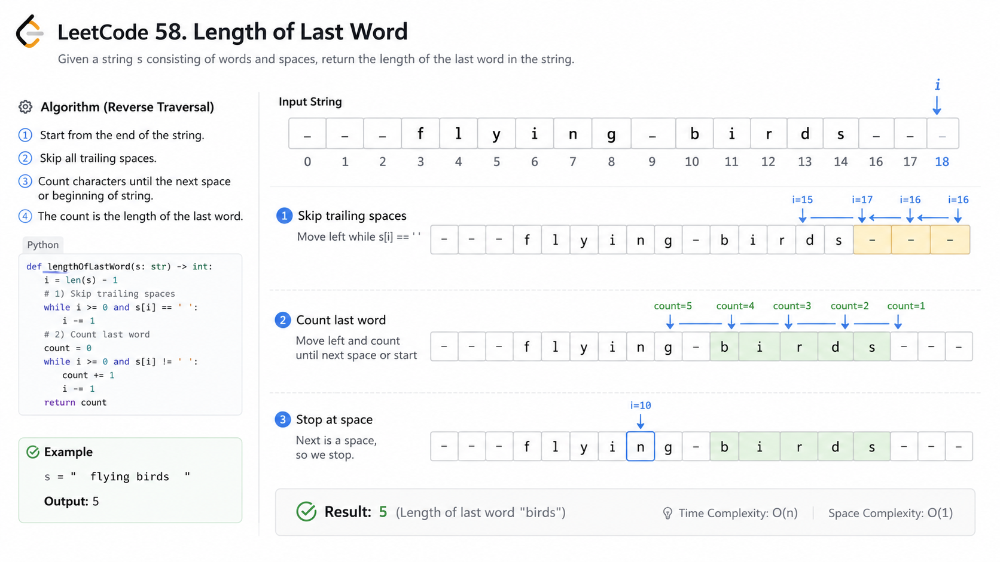
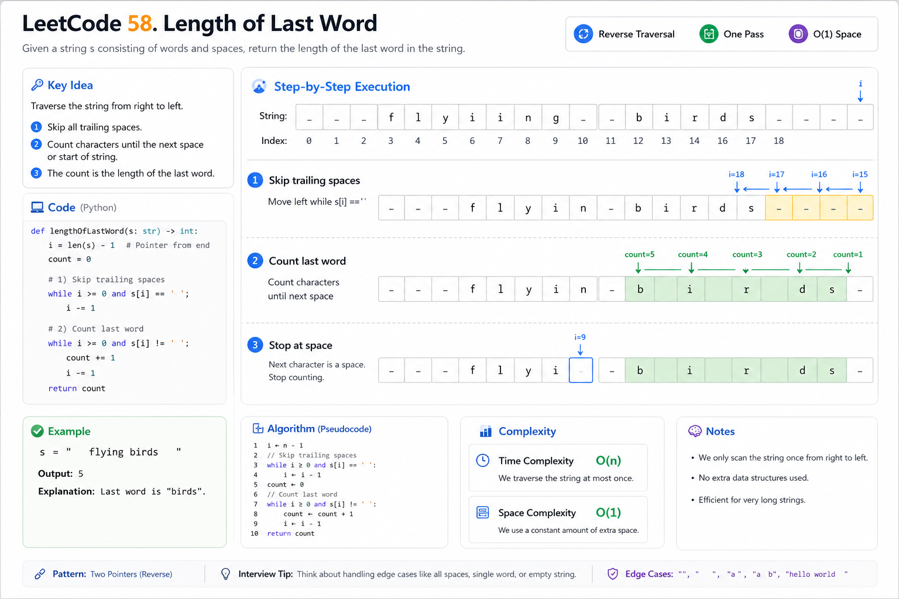
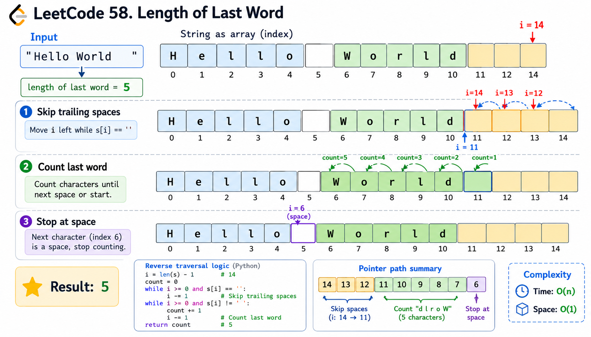
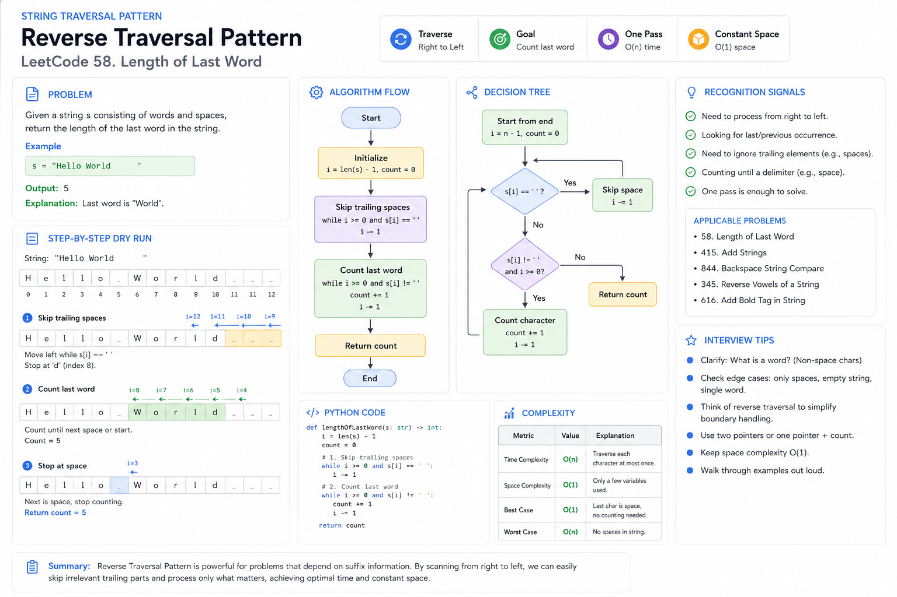

# LeetCode 58 — Length of Last Word


## Visual Overview



## State Transition



## Dry Run Visualization



## Pattern Summary




# Pattern Summary

### Primary Pattern
**String Traversal**

### Secondary Pattern
**Reverse Traversal**

### Difficulty
Easy

### Frequency
High

### Interview Expectation
Solve in:

```text
Time  : O(n)
Space : O(1)
```

without using:

```text
split()
```

---

# Recognition Signals

When the problem contains phrases like:

```text
Last word
Last element
Trailing spaces
Final segment
Rightmost value
Need only the end portion
```

consider:

```text
Reverse Traversal
```

instead of scanning from the beginning.

---

## Common Pattern Clues

### Clue 1

```text
Need information about the last item only
```

→ Start from the end.

---

### Clue 2

```text
Trailing spaces exist
```

→ Skip irrelevant characters first.

---

### Clue 3

```text
Only length is needed
```

→ Count directly.

No need to create substrings.

---

### Clue 4

```text
Optimize space usage
```

→ Avoid:

```text
split()
trim()
substring()
```

if possible.

---

# Core Idea

The last word is the final sequence of consecutive non-space characters.

Algorithm:

```text
1. Start from end
2. Skip spaces
3. Count characters
4. Stop at space
5. Return count
```

---

# Visual Template

```text
Input:

"Hello World   "

              ^
              Start

Step 1:

Skip spaces

"Hello World"
           ^

Step 2:

Count backwards

d → 1
l → 2
r → 3
o → 4
W → 5

Step 3:

Encounter space

Return 5
```

---

# Generic Reverse Traversal Template

```text
pointer = n - 1

while pointer >= 0 and current is separator
    pointer--

answer = 0

while pointer >= 0 and current is valid
    answer++
    pointer--

return answer
```

---

# Language-Agnostic Pseudocode

```text
function lengthOfLastWord(s):

    i = length(s) - 1

    while i >= 0 and s[i] == ' ':
        i--

    count = 0

    while i >= 0 and s[i] != ' ':
        count++
        i--

    return count
```

---

# Complexity Cheatsheet

| Approach | Time | Space |
|-----------|--------|--------|
| Split String | O(n) | O(n) |
| Trim + Scan | O(n) | O(n)* |
| Reverse Traversal | O(n) | O(1) |

\* Depends on language implementation.

---

# Optimization Journey

### Level 1

```text
Split
```

Easy but inefficient.

---

### Level 2

```text
Trim
+
Scan
```

Improved but may allocate memory.

---

### Level 3

```text
Reverse Traversal
```

Optimal.

---

# Common Pitfalls

## Mistake 1

Forgetting trailing spaces.

```text
"Hello World   "
```

Must skip spaces first.

---

## Mistake 2

Using split() blindly.

Example:

```text
"Hello World  "
```

May create empty elements.

---

## Mistake 3

Ignoring single-word inputs.

```text
"leetcode"
```

Entire string is the answer.

---

## Mistake 4

Index Out of Bounds

Always check:

```text
i >= 0
```

before accessing:

```text
s[i]
```

---

# Edge Cases Checklist

### Empty String

```text
""
```

Output:

```text
0
```

---

### Only Spaces

```text
"     "
```

Output:

```text
0
```

---

### Single Word

```text
"leetcode"
```

Output:

```text
8
```

---

### Trailing Spaces

```text
"Hello World   "
```

Output:

```text
5
```

---

### Multiple Spaces Between Words

```text
"a   b   c"
```

Output:

```text
1
```

---

# Interview Sound Bites

### Intuition

> Since only the final word matters, I can scan from the end and ignore everything else.

---

### Why It Works

> After skipping trailing spaces, the first continuous sequence of non-space characters is guaranteed to be the last word.

---

### Complexity

> Each character is visited at most once, giving O(n) time and O(1) extra space.

---

# Similar Problems

## Easy

### 344. Reverse String

Pattern:

```text
Reverse Traversal
```

---

### 125. Valid Palindrome

Pattern:

```text
Two Pointers
Character Processing
```

---

## Medium

### 151. Reverse Words in a String

Pattern:

```text
String Traversal
Word Manipulation
```

---

### 680. Valid Palindrome II

Pattern:

```text
Two Pointers
String Processing
```

---

### 3. Longest Substring Without Repeating Characters

Pattern:

```text
String Traversal
Sliding Window
```

---

# Quick Revision Notes

```text
PATTERN:
Reverse Traversal

STEPS:
1. Start at end
2. Skip spaces
3. Count letters
4. Stop at space
5. Return count

TIME:
O(n)

SPACE:
O(1)

INTERVIEW FAVORITE:
Avoid split()

KEY INSIGHT:
The last word is the first block of
non-space characters encountered
after removing trailing spaces.
```

---

# One-Minute Revision

```text
Need last word length?

↓

Start from end

↓

Skip spaces

↓

Count characters

↓

Hit space or beginning

↓

Return count

Complexity:
O(n) Time
O(1) Space
```