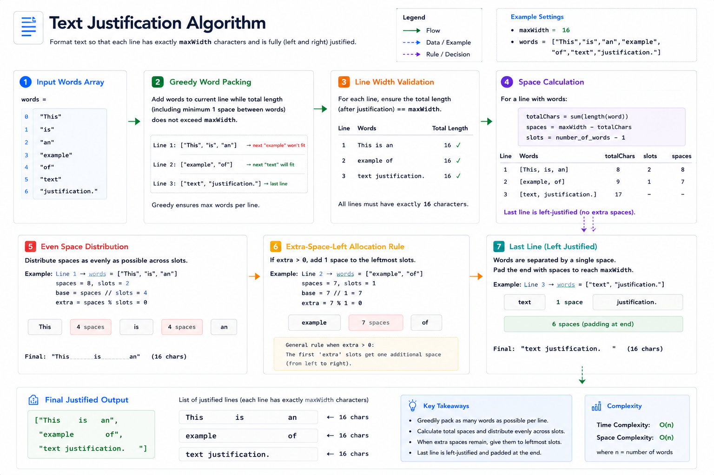
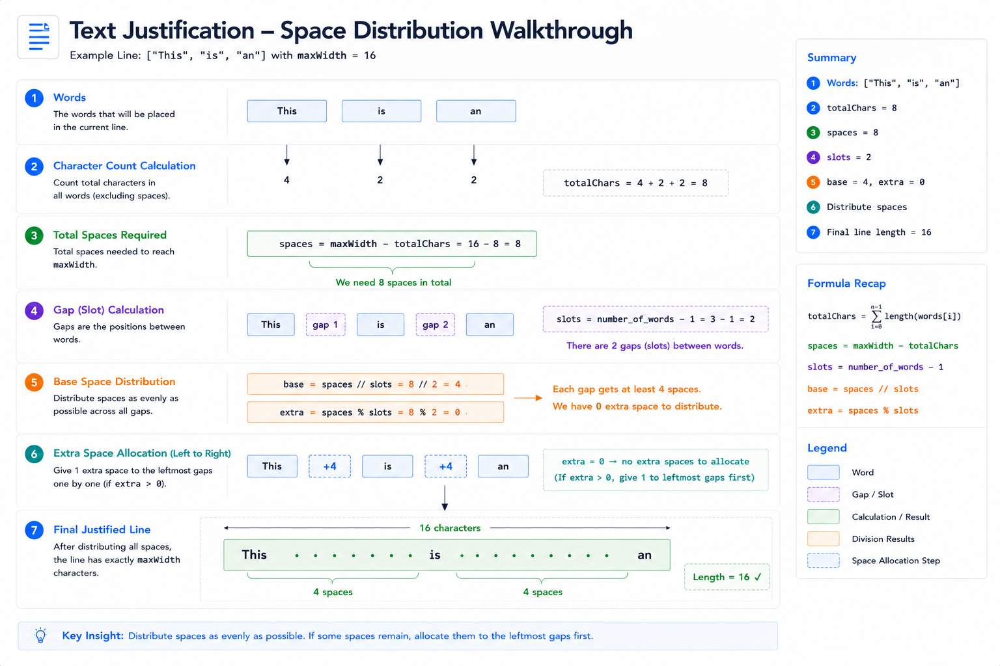

# Text Justification (#68) — Cheat Sheet

## Visual Overview



## Space Distribution Visualization



## State Machine Visualization


## Pattern Summary

### Primary Pattern
**Simulation**

### Secondary Pattern
**Greedy**

### Difficulty
**Hard**

### Core Idea

```text
1. Greedily pack words into a line.
2. Calculate remaining spaces.
3. Distribute spaces evenly.
4. Extra spaces go to left-most gaps.
5. Last line is left-justified.
```

---

# Recognition Signals

Use this pattern when the problem mentions:

### Signal 1

```text
Format output according to rules
```

### Signal 2

```text
Distribute spaces/characters
```

### Signal 3

```text
Construct strings line by line
```

### Signal 4

```text
Follow exact formatting requirements
```

### Signal 5

```text
Greedily place items until capacity is reached
```

---

# Problem Template

## Step 1 — Collect Words For Current Line

```text
while nextWordFits:
    addWord()
```

Fit condition:

currentLength
+
spacesBetweenWords
+
nextWordLength
<= maxWidth

---

## Step 2 — Determine Line Type

```text
Normal Line
Last Line
Single Word Line
```

---

## Step 3 — Calculate Space Distribution

```text
totalSpaces = maxWidth - totalWordLength

gaps = wordsInLine - 1
```

---

## Step 4 — Handle Special Cases

### Last Line

```text
word1 word2 word3____
```

Single spaces only.

Remaining spaces go to end.

---

### Single Word

```text
hello________
```

Pad remaining spaces.

---

### Normal Line

Distribute spaces evenly.

---

## Step 5 — Build Result

Append formatted line.

Continue until all words are processed.

---

# Key Formula

## Total Spaces

```text
totalSpaces
=
maxWidth - totalWordLength
```

---

## Number Of Gaps

```text
gaps
=
numberOfWords - 1
```

---

## Base Space Allocation

```text
baseSpaces
=
totalSpaces / gaps
```

Integer division.

---

## Extra Space Allocation

```text
extraSpaces
=
totalSpaces % gaps
```

---

## Distribution Rule

```text
First extraSpaces gaps
receive one additional space.
```

Example:

```text
totalSpaces = 8
gaps = 3
```

```text
baseSpaces = 2
extraSpaces = 2
```

Result:

```text
3,3,2
```

---

# Complexity Cheatsheet

| Operation | Complexity |
|------------|------------|
| Scan words | O(N) |
| Build line | O(maxWidth) |
| Space distribution | O(gaps) |
| Overall | O(N) |

Where:

```text
N = total characters across all words
```

---

## Time Complexity

```text
O(N)
```

---

## Space Complexity

```text
O(maxWidth)
```

excluding output.

---

# Visual Memory Trick

Imagine a newspaper editor:

```text
Take as many words as fit.

Spread spaces evenly.

Put leftover spaces on the left.

Last line stays natural.
```

Example:

```text
This____is____an
```

Not:

```text
This___is_____an
```

---

# Common Pitfalls

## Pitfall 1

Forgetting last line rule.

Wrong:

```text
Fully justified last line
```

Correct:

```text
Left justified last line
```

---

## Pitfall 2

Division By Zero

When:

```text
gaps = 0
```

Single-word line.

Handle separately.

---

## Pitfall 3

Wrong Space Direction

Wrong:

```text
Extra spaces on right
```

Correct:

```text
Extra spaces on left
```

---

## Pitfall 4

Using Current Line Length Incorrectly

Remember:

```text
currentLength
includes required separators
during line construction
```

---

## Pitfall 5

Off-By-One Errors

Always verify:

```text
Final line length == maxWidth
```

---

# Interview Answer Template

When asked for the approach:

```text
I greedily determine which words belong to
the current line.

Once the line is fixed, I calculate how many
spaces remain.

For normal lines, spaces are distributed
evenly across gaps, and any remainder is
assigned from left to right.

For the last line and single-word lines,
I left justify and pad remaining spaces
at the end.

Each word is processed once, resulting in
O(N) time complexity.
```

---

# Similar Problems

## Same Pattern (Simulation)

### #6 Zigzag Conversion

```text
Simulate character placement.
```

---

### #71 Simplify Path

```text
Simulate filesystem traversal.
```

---

### #54 Spiral Matrix

```text
Simulate directional movement.
```

---

### #59 Spiral Matrix II

```text
Simulate matrix construction.
```

---

## String Processing

### #151 Reverse Words in a String

```text
Word manipulation.
```

---

### #58 Length of Last Word

```text
String traversal.
```

---

## Greedy Construction

### #763 Partition Labels

```text
Greedy partition creation.
```

---

### #135 Candy

```text
Greedy resource distribution.
```

---

# Quick Revision Notes

### What Pattern?

```text
Simulation + Greedy
```

---

### Why Greedy?

```text
Problem explicitly requires
maximum words per line.
```

---

### Main Formula

```text
baseSpaces = totalSpaces / gaps

extraSpaces = totalSpaces % gaps
```

---

### Special Cases

```text
Last Line

Single Word Line
```

---

### Distribution Rule

```text
Extra spaces go LEFT first.
```

---

### Complexity

```text
Time  : O(N)

Space : O(maxWidth)
```

---

### One-Line Memory Aid

```text
Pack greedily,
distribute evenly,
extras left,
last line natural.
```