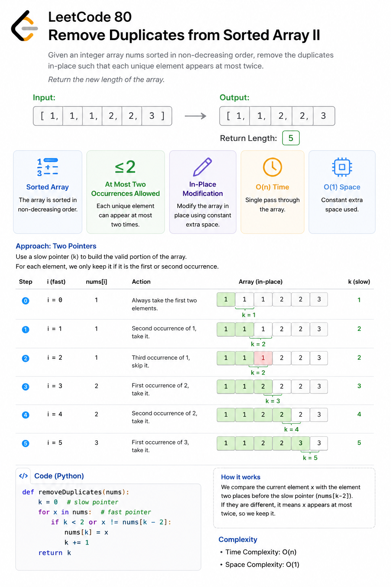
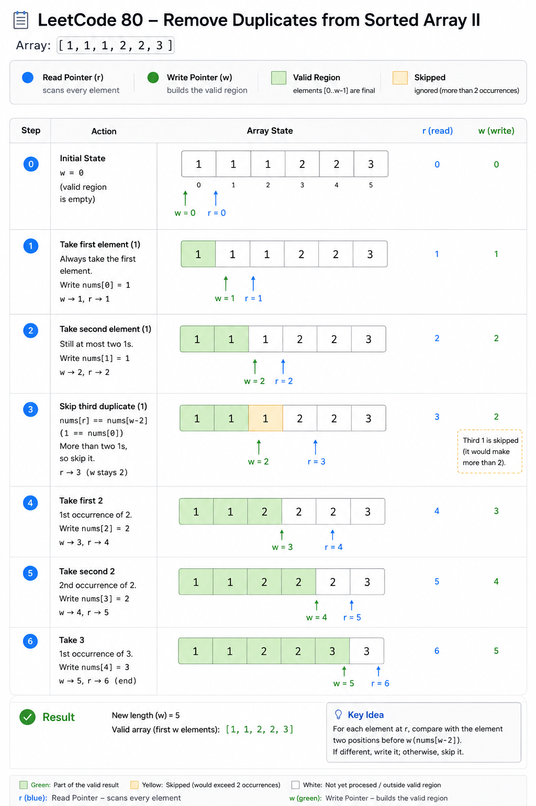
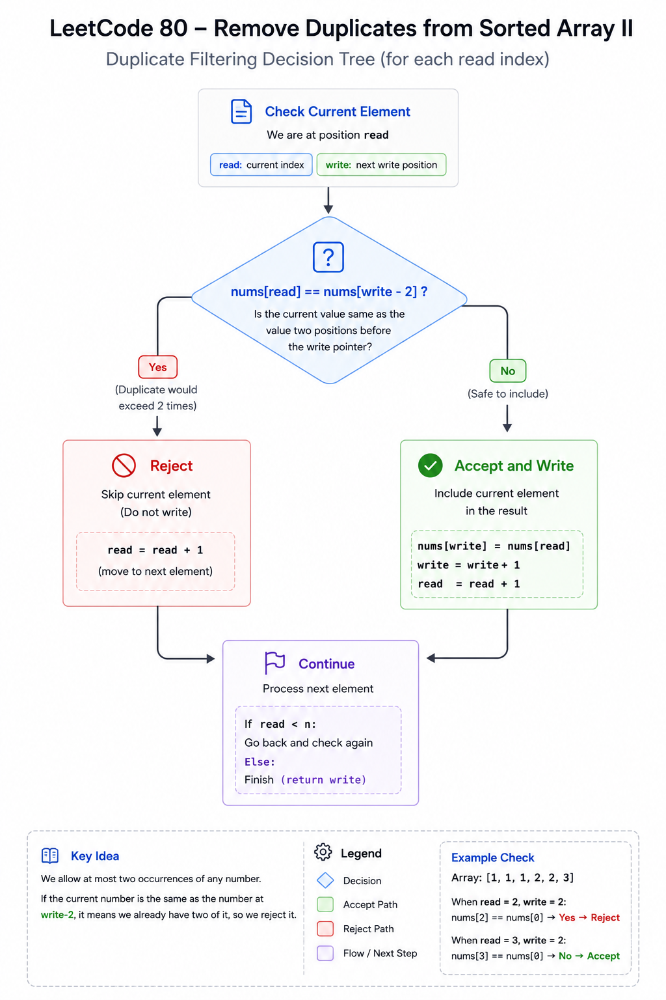
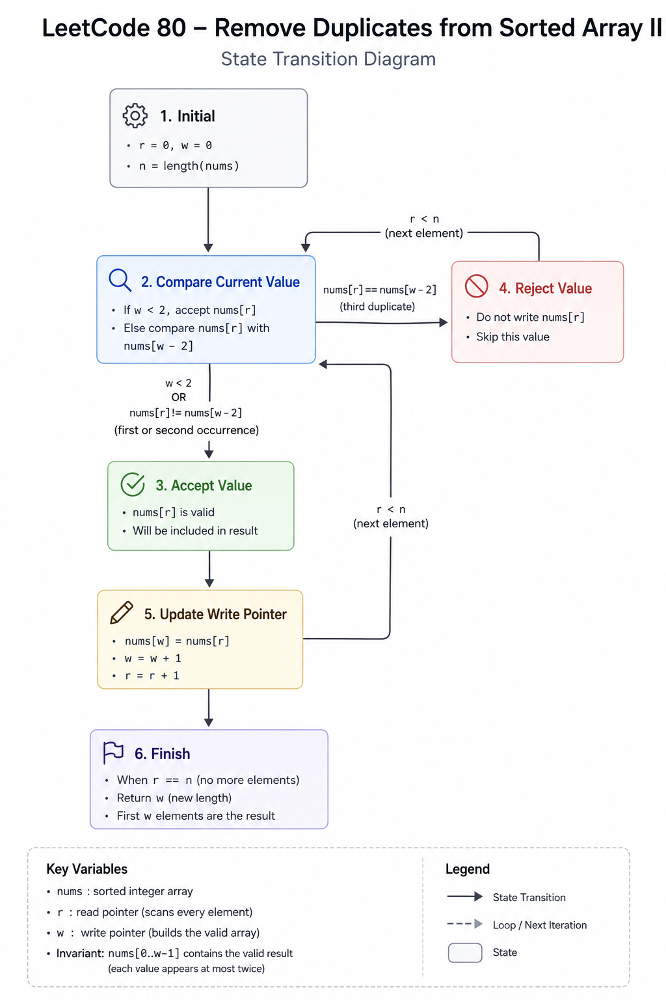

# Remove Duplicates from Sorted Array II — Cheat Sheet

## Visual Explanation

### Algorithm Overview



### Two Pointer Walkthrough



### Decision Tree



### State Transition



## Pattern Summary

### Primary Pattern

```text
Two Pointers
```

### Secondary Pattern

```text
In-Place Array Modification
```

### Difficulty

```text
Medium
```

### LeetCode

```text
80. Remove Duplicates from Sorted Array II
```

---

# Recognition Signals

Look for these clues in the problem statement:

### Signal 1

```text
Sorted Array
```

Duplicates appear together.

---

### Signal 2

```text
Modify in-place
```

Avoid extra arrays.

---

### Signal 3

```text
Return new length
```

Often indicates:

```text
Read Pointer + Write Pointer
```

pattern.

---

### Signal 4

```text
Keep at most K occurrences
```

Strong indicator of:

```text
Frequency-limited compression
```

---

### Signal 5

```text
O(1) extra space
```

Pushes toward:

```text
Two Pointers
```

instead of:

```text
HashMap
```

---

# Core Insight

Because the array is sorted:

```text
Equal values are adjacent.
```

We can determine whether a value has already appeared twice by checking:

```text
nums[write - 2]
```

---

# Key Formula

## Allow At Most Two Duplicates

```text
if nums[read] != nums[write - 2]
```

Keep the element.

---

## Generalized Version

Allow at most K duplicates:

```text
if nums[read] != nums[write - K]
```

---

# Visual Template

## Before

```text
[1,1,1,2,2,3]
      R
    W
```

---

## Skip Third Duplicate

```text
1 == nums[write - 2]

Skip
```

---

## Keep New Value

```text
2 != nums[write - 2]

Write
```

---

## After

```text
[1,1,2,2,3]
```

---

# Algorithm Template

```text
if length <= K
    return length

write = K

for read from K to n - 1

    if nums[read] != nums[write - K]

        nums[write] = nums[read]
        write++

return write
```

---

# Standard Solution

```text
write = 2

for read = 2 to n - 1

    if nums[read] != nums[write - 2]

        nums[write] = nums[read]
        write++

return write
```

---

# Complexity Cheatsheet

| Approach | Time | Space |
|-----------|--------|--------|
| Brute Force | O(n) | O(n) |
| Two Pointers | O(n) | O(1) |

---

# Invariant

At every step:

```text
nums[0...write-1]
```

contains a valid solution.

No value appears more than twice.

---

# Pointer Roles

## Read Pointer

```text
read
```

Responsible for:

```text
Scanning input
```

---

## Write Pointer

```text
write
```

Responsible for:

```text
Building output
```

---

# Edge Cases

## Empty Array

```text
[]
```

Return:

```text
0
```

---

## One Element

```text
[5]
```

Return:

```text
1
```

---

## Two Elements

```text
[5,5]
```

Return:

```text
2
```

---

## All Duplicates

```text
[1,1,1,1,1]
```

Return:

```text
[1,1]
```

Length:

```text
2
```

---

## Negative Values

```text
[-1,-1,-1,0]
```

Works without modification.

---

# Common Pitfalls

## Pitfall 1

Using:

```text
nums[i] != nums[i - 1]
```

This solves:

```text
LeetCode 26
```

not:

```text
LeetCode 80
```

---

## Pitfall 2

Starting write incorrectly.

Correct:

```text
write = 2
```

---

## Pitfall 3

Forgetting:

```text
len(nums) <= 2
```

edge case.

---

## Pitfall 4

Using extra arrays.

Violates:

```text
O(1) space
```

requirement.

---

# Interview Quick Answer

### What pattern is this?

```text
Two Pointers
```

---

### Why does it work?

```text
Array is sorted.
```

Duplicates are adjacent.

We can detect whether two copies already exist by comparing with:

```text
nums[write - 2]
```

---

### Complexity?

```text
Time:  O(n)
Space: O(1)
```

---

# Generalization Formula

## Allow At Most One Copy

LeetCode 26

```text
write = 1

if nums[read] != nums[write - 1]
```

---

## Allow At Most Two Copies

LeetCode 80

```text
write = 2

if nums[read] != nums[write - 2]
```

---

## Allow At Most K Copies

Generic Solution

```text
write = K

if nums[read] != nums[write - K]
```

---

# Similar Problems

## Easy

### 26. Remove Duplicates from Sorted Array

Same pattern.

Only one copy allowed.

---

### 283. Move Zeroes

Read/Write pointer movement.

---

## Medium

### 27. Remove Element

In-place array filtering.

---

### 75. Sort Colors

Pointer-based array manipulation.

---

### 189. Rotate Array

In-place array transformation.

---

### 977. Squares of a Sorted Array

Sorted-array two-pointer technique.

---

## Advanced

### 15. 3Sum

Multiple pointers.

---

### 167. Two Sum II

Sorted array pointer optimization.

---

# Memory Hook

Think:

```text
write - 2
```

means:

"Do I already have two copies
of this value?"
```

If:

```text
nums[read] == nums[write - 2]
```

then:

```text
Reject
```

Otherwise:

```text
Accept
```

---

# 10-Second Revision

### Pattern

```text
Two Pointers
```

### Sorted?

```text
Yes
```

### Write Starts At

```text
2
```

### Keep Condition

```text
nums[read] != nums[write - 2]
```

### Time

```text
O(n)
```

### Space

```text
O(1)
```

### Follow-up

```text
Replace 2 with K
```

to allow at most K duplicates.