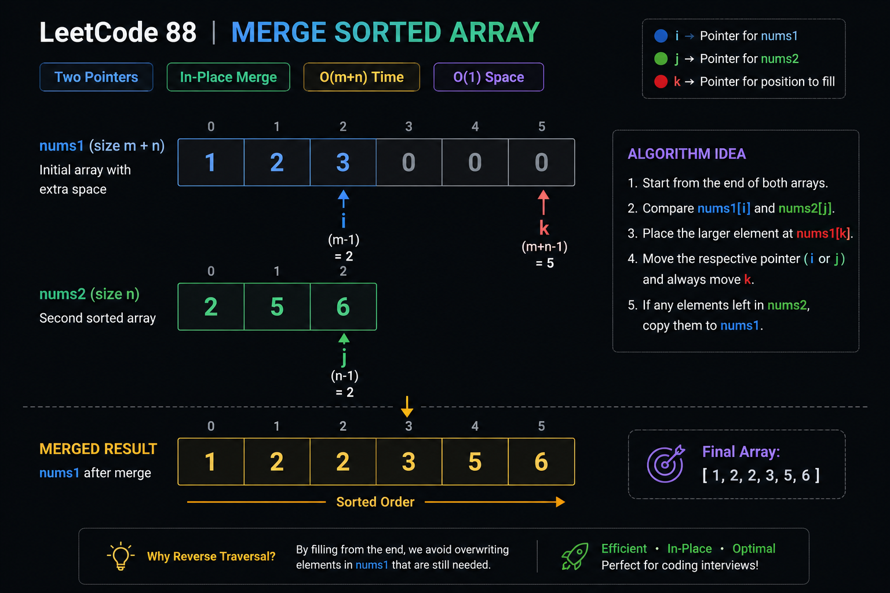

# Merge Sorted Array



## Problem Statement

You are given two integer arrays `nums1` and `nums2`, sorted in non-decreasing order, and two integers `m` and `n`, representing the number of valid elements in `nums1` and `nums2`.

Merge `nums2` into `nums1` as one sorted array.

The final sorted array should be stored inside `nums1`.

### Example

```text
Input:
nums1 = [1,2,3,0,0,0]
m = 3

nums2 = [2,5,6]
n = 3

Output:
[1,2,2,3,5,6]
```

---

## Difficulty

**Easy**

---

## Tags

* Array
* Two Pointers
* Sorting
* In-place Algorithm

---

## Pattern

### Primary Pattern

**Two Pointers**

### Secondary Pattern

**Reverse Merge**

---

# Intuition

A common mistake is to merge elements from the beginning.

Why is that problematic?

Because `nums1` already contains valid elements.

If we start inserting from the front, we overwrite data that we still need.

Instead:

* Start from the end.
* Compare the largest remaining elements.
* Place the larger one into the last available position.
* Move backwards.

This avoids overwriting any useful data.

---

# Key Observation

Since both arrays are already sorted:

```text
nums1: [1,2,3,0,0,0]
nums2: [2,5,6]
```

The largest element must be either:

```text
nums1[m-1]
or
nums2[n-1]
```

Place that element at:

```text
nums1[m+n-1]
```

Then continue moving backwards.

This creates an in-place merge with O(1) extra space.

---

# Brute Force Approach

## Algorithm

1. Create a temporary array.
2. Copy valid elements from `nums1`.
3. Copy all elements from `nums2`.
4. Sort the resulting array.
5. Copy back into `nums1`.

---

## Complexity

| Metric | Value             |
| ------ | ----------------- |
| Time   | O((m+n) log(m+n)) |
| Space  | O(m+n)            |

---

## Limitations

* Uses extra memory.
* Ignores the fact that both arrays are already sorted.
* Not the optimal interview solution.

---

# Optimized Approach

## Algorithm

Initialize:

```text
i = m - 1
j = n - 1
k = m + n - 1
```

While both arrays have elements:

```text
Compare nums1[i] and nums2[j]

Place larger element at nums1[k]

Move corresponding pointer
Move k backward
```

After that:

```text
If nums2 still has elements,
copy them into nums1.
```

No need to copy remaining elements from nums1 because they are already in place.

---

## Why It Works

At every step:

```text
nums1[k]
```

receives the largest unmerged value.

Since we fill positions from right to left:

* No useful value gets overwritten.
* Sorted order is preserved.
* Extra memory is unnecessary.

---

## Complexity

| Metric | Value  |
| ------ | ------ |
| Time   | O(m+n) |
| Space  | O(1)   |

---

# Edge Cases

## Empty nums2

```text
nums1 = [1]
m = 1

nums2 = []
n = 0

Output:
[1]
```

---

## Empty nums1 Values

```text
nums1 = [0]
m = 0

nums2 = [1]
n = 1

Output:
[1]
```

---

## Single Element Arrays

```text
nums1 = [2,0]
nums2 = [1]

Output:
[1,2]
```

---

## Duplicate Values

```text
nums1 = [1,2,2,0,0]
nums2 = [2,2]

Output:
[1,2,2,2,2]
```

---

## Negative Values

```text
nums1 = [-5,-2,0,0]
nums2 = [-4,-1]

Output:
[-5,-4,-2,-1]
```

---

## Large Inputs

```text
m = 1000
n = 1000
```

Algorithm still runs efficiently in:

```text
O(m+n)
```

---

# Dry Run

### Input

```text
nums1 = [1,2,3,0,0,0]
m = 3

nums2 = [2,5,6]
n = 3
```

---

### Initial State

```text
i = 2 -> 3
j = 2 -> 6
k = 5
```

| Step | nums1[i] | nums2[j] | Chosen | Position k | Array State   |
| ---- | -------- | -------- | ------ | ---------- | ------------- |
| 1    | 3        | 6        | 6      | 5          | [1,2,3,0,0,6] |
| 2    | 3        | 5        | 5      | 4          | [1,2,3,0,5,6] |
| 3    | 3        | 2        | 3      | 3          | [1,2,3,3,5,6] |
| 4    | 2        | 2        | 2      | 2          | [1,2,2,3,5,6] |

Remaining element:

```text
nums1 already in correct place
```

Final:

```text
[1,2,2,3,5,6]
```

---

# Common Mistakes

### 1. Merging From Front

```text
Overwrite useful values.
```

---

### 2. Using Extra Array

```text
Works
But not optimal.
```

---

### 3. Forgetting Remaining nums2 Elements

After the main loop:

```text
while j >= 0
```

must be handled.

---

### 4. Copying Remaining nums1 Elements

Unnecessary.

Those elements are already correctly placed.

---

# Interview Discussion

### Why Start From The End?

Because `nums1` contains extra space at the back.

Starting from the front risks overwriting valid elements.

---

### Why Is Remaining nums1 Ignored?

If `nums2` is exhausted:

```text
nums1 values are already sorted
and already in correct position.
```

---

### Can We Solve Without Extra Space?

Yes.

That is the intended solution.

---

# Follow-up Questions

### What if nums1 had no extra capacity?

You would need:

* Extra memory
* Or a gap-based merge approach

---

### What if arrays were not sorted?

You would first sort them:

```text
O((m+n) log(m+n))
```

---

### Can This Technique Be Used For Linked Lists?

Yes.

The same merge concept is used in:

* Merge Sort
* Merging Sorted Linked Lists

---

# Real World Applications

### Database Merge Operations

Combining sorted records efficiently.

---

### Log Aggregation Systems

Merging multiple time-ordered event streams.

---

### Search Engines

Combining sorted posting lists.

---

### Distributed Systems

Merging sorted outputs from multiple workers.

---

# Related Problems

* LeetCode 21: Merge Two Sorted Lists
* LeetCode 56: Merge Intervals
* LeetCode 977: Squares of a Sorted Array
* LeetCode 283: Move Zeroes
* LeetCode 167: Two Sum II

---