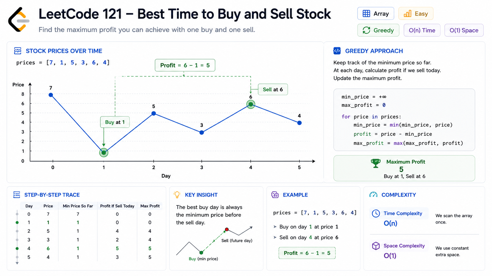
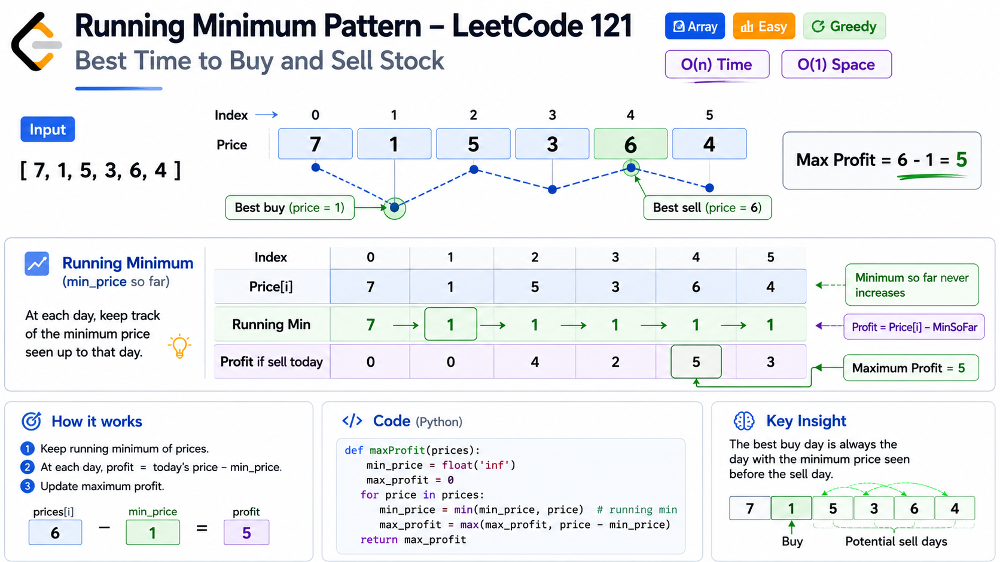
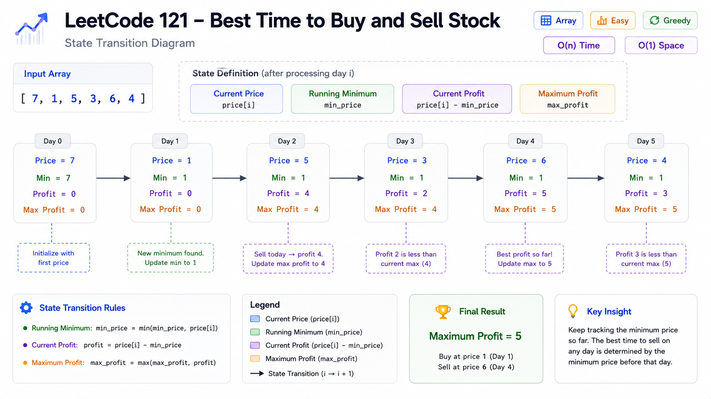
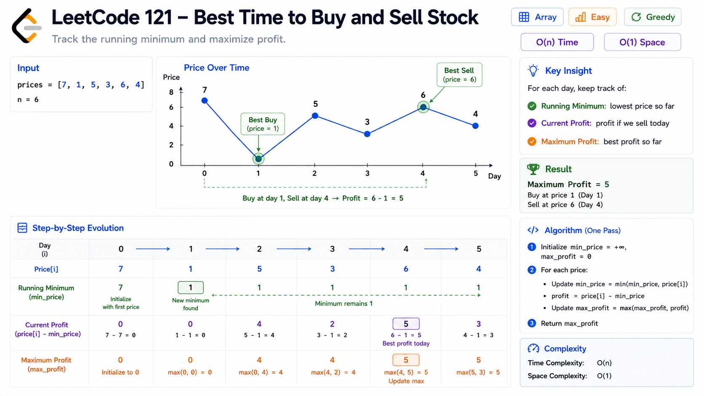
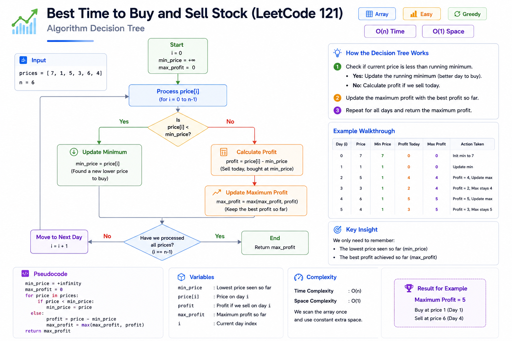

# Cheat Sheet — Best Time to Buy and Sell Stock (LeetCode 121)

## Visual Explanation

### Stock Price Timeline



### Running Minimum Pattern



### State Transition



### Profit Evolution



### Decision Tree



## Pattern Summary

### Primary Pattern

```text
Running Minimum
```

### Secondary Pattern

```text
Greedy
State Tracking
```

### Core Idea

While traversing the array:

```text
Track the lowest price seen so far.
```

For each day:

```text
profit = currentPrice - minPrice
```

Update:

```text
maxProfit = max(maxProfit, profit)
```

---

## Recognition Signals

Look for this pattern when the problem says:

### Signal 1

```text
Find maximum difference.
```

Examples:

- Maximum Profit
- Maximum Gain
- Maximum Increase

---

### Signal 2

```text
Buy before sell
```

or

```text
Earlier index before later index
```

Ordering matters.

---

### Signal 3

```text
Only one transaction allowed
```

Common stock-trading interview constraint.

---

### Signal 4

Need:

```text
Best value before current position
```

Examples:

```text
Current Value - Minimum Previous Value
```

---

### Signal 5

Array is scanned from left to right.

Often indicates:

```text
Running State Tracking
```

---

## Key Formula

### Profit Formula

```text
profit = sellPrice - buyPrice
```

---

### Running Minimum Formula

```text
minPrice = min(minPrice, currentPrice)
```

---

### Maximum Profit Formula

```text
maxProfit = max(maxProfit, currentPrice - minPrice)
```

---

## Algorithm Template

```text
Initialize:

minPrice = prices[0]
maxProfit = 0

For each price:

    minPrice = min(minPrice, price)

    profit = price - minPrice

    maxProfit = max(maxProfit, profit)

Return maxProfit
```

---

## Visual Mental Model

```text
Prices

[7,1,5,3,6,4]

Lowest Price Seen
     ↓
     1

Current Sell Candidate
           ↓
           6

Profit

6 - 1 = 5
```

Think:

```text
Best Buy So Far
+
Sell Today
=
Today's Best Profit
```

---

## Complexity Cheatsheet

| Approach | Time | Space |
|-----------|--------|--------|
| Brute Force | O(n²) | O(1) |
| Running Minimum | O(n) | O(1) |

---

### Optimal Complexity

```text
Time  = O(n)
Space = O(1)
```

---

## State Variables

### minPrice

Stores:

```text
Lowest stock price encountered so far.
```

---

### maxProfit

Stores:

```text
Largest profit found so far.
```

---

## Invariant

Before processing index i:

```text
minPrice
```

always equals:

```text
minimum(prices[0...i])
```

This guarantees correctness.

---

## Common Mistakes

### Mistake 1

Using:

```text
globalMax - globalMin
```

Incorrect.

Because:

```text
Buy must happen before sell.
```

---

### Mistake 2

Returning negative profit.

Example:

```text
[7,6,5,4]
```

Correct answer:

```text
0
```

Not:

```text
-1
```

---

### Mistake 3

Using nested loops.

```text
O(n²)
```

Unnecessary.

---

### Mistake 4

Forgetting to update minimum price.

Always maintain:

```text
Best buying opportunity.
```

---

## Edge Cases

### Empty Array

```text
[]
```

Answer:

```text
0
```

---

### Single Element

```text
[5]
```

Answer:

```text
0
```

---

### Decreasing Prices

```text
[7,6,5,4]
```

Answer:

```text
0
```

---

### Equal Prices

```text
[3,3,3,3]
```

Answer:

```text
0
```

---

### Increasing Prices

```text
[1,2,3,4,5]
```

Answer:

```text
4
```

---

## Optimization Journey

### Step 1

Brute Force

```text
Try every pair.
```

Complexity:

```text
O(n²)
```

---

### Step 2

Observation

```text
Only the minimum previous price matters.
```

---

### Step 3

Track Running Minimum

```text
minPrice
```

---

### Step 4

Compute Profit On The Fly

```text
currentPrice - minPrice
```

---

### Step 5

Track Best Result

```text
maxProfit
```

---

## Similar Problems

### Same Stock Series

- LeetCode 122 — Best Time to Buy and Sell Stock II
- LeetCode 123 — Best Time to Buy and Sell Stock III
- LeetCode 188 — Best Time to Buy and Sell Stock IV
- LeetCode 309 — Best Time to Buy and Sell Stock with Cooldown
- LeetCode 714 — Best Time to Buy and Sell Stock with Transaction Fee

---

### Same Pattern

#### Maximum Difference Between Increasing Elements

```text
LeetCode 2016
```

Same idea:

```text
Track minimum so far.
```

---

#### Maximum Subarray

```text
LeetCode 53
```

Related optimization thinking.

---

#### Longest Continuous Increasing Subsequence

```text
LeetCode 674
```

Running-state pattern.

---

## Interview Sound Bite

> "I maintain the minimum stock price seen so far and calculate the profit if I sell on the current day. By updating the running minimum and maximum profit in one pass, I reduce the solution from O(n²) to O(n) time while using O(1) extra space."

---

## 30-Second Revision

### Remember

```text
One Buy
One Sell
Buy Before Sell
```

Track:

```text
minPrice
maxProfit
```

Formula:

```text
profit = currentPrice - minPrice
```

Update:

```text
minPrice = min(minPrice, currentPrice)

maxProfit = max(maxProfit, profit)
```

Final Complexity:

```text
Time  = O(n)
Space = O(1)
```

---

## One-Line Memory Trick

```text
Keep the cheapest stock seen so far and calculate how much money you would make by selling today.
```