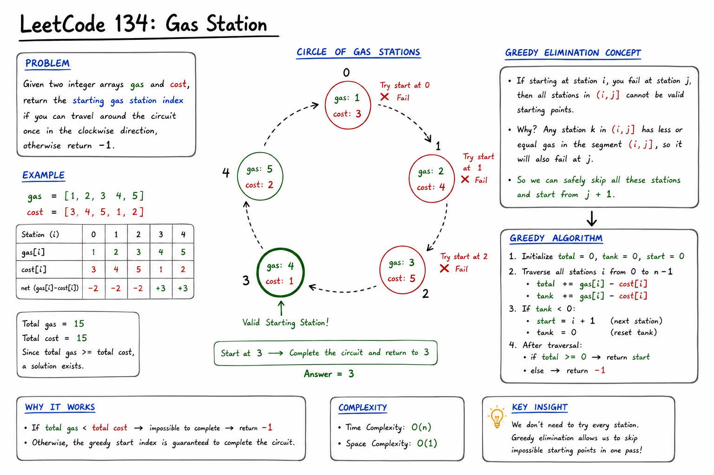
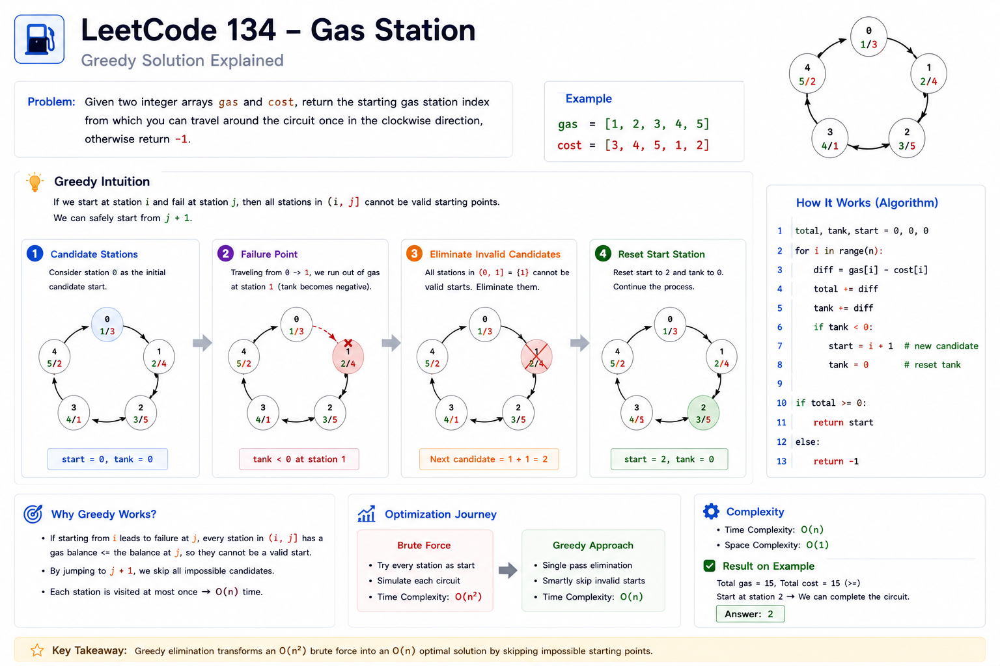
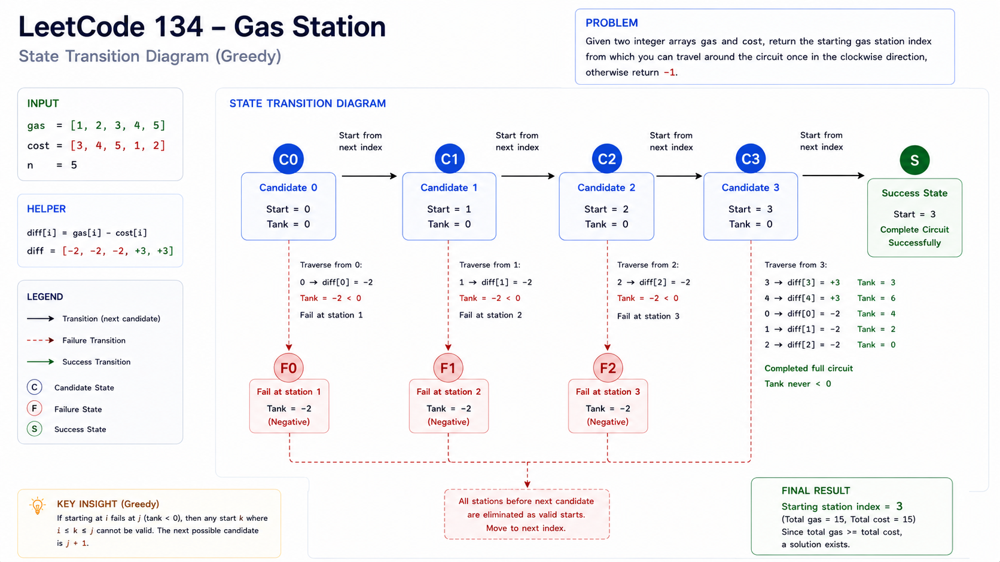
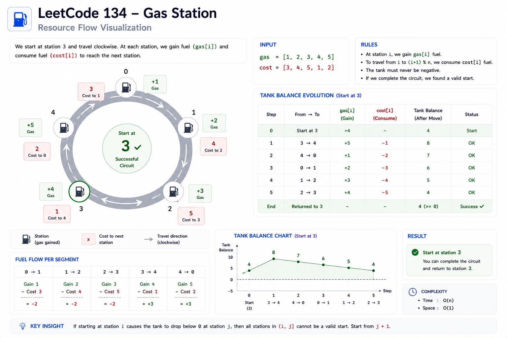

# 134. Gas Station — Cheat Sheet

## Visual Explanation

### Whiteboard Style


### Greedy Elimination Infographic


### State Transition Diagram


### Circular Route Resource Flow



---

# Pattern Summary

## Primary Pattern

**Greedy**

## Secondary Pattern

**Circular Array Traversal**

## Core Idea

Track the running fuel balance while traversing all stations.

Whenever the running tank becomes negative:

```text
currentTank < 0
```

the current candidate starting station and every station before the failure point become invalid.

Move the candidate start to:

```text
i + 1
```

and continue.

---

# Recognition Signals

Use this pattern when you see:

### Signal 1

Circular route traversal.

```text
0 → 1 → 2 → ... → n-1 → 0
```

---

### Signal 2

Need to find a valid starting position.

Examples:

- Starting station
- Starting index
- Starting node

---

### Signal 3

Resource accumulation.

Examples:

```text
Fuel
Energy
Coins
Battery
Capacity
Budget
```

---

### Signal 4

Local failures can eliminate future candidates.

A common Greedy indicator.

---

### Signal 5

The problem asks:

```text
Does a valid start exist?
```

instead of:

```text
Count all possibilities
```

---

# Key Formula

For each station:

```text
difference = gas[i] - cost[i]
```

---

## Global Feasibility

```text
totalBalance = Σ(gas[i] - cost[i])
```

If:

```text
totalBalance < 0
```

Answer:

```text
-1
```

No valid solution exists.

---

## Local Feasibility

```text
currentTank += gas[i] - cost[i]
```

If:

```text
currentTank < 0
```

then:

```text
startStation = i + 1
currentTank = 0
```

---

# Greedy Rule (Most Important)

If:

```text
start = s
```

fails at:

```text
i
```

then every station in:

```text
[s ... i]
```

must also fail.

Therefore:

```text
Skip Entire Range
```

This transforms:

```text
O(n²)
```

into:

```text
O(n)
```

---

# Template

```java
int totalBalance = 0;
int currentTank = 0;
int startStation = 0;

for (int i = 0; i < n; i++) {
    int diff = gas[i] - cost[i];

    totalBalance += diff;
    currentTank += diff;

    if (currentTank < 0) {
        startStation = i + 1;
        currentTank = 0;
    }
}

return totalBalance >= 0
       ? startStation
       : -1;
```

---

# Complexity Cheatsheet

| Approach | Time | Space |
|-----------|--------|--------|
| Brute Force | O(n²) | O(1) |
| Greedy | O(n) | O(1) |

---

# Variable Roles

| Variable | Purpose |
|------------|------------|
| totalBalance | Checks if solution exists |
| currentTank | Tracks current route |
| startStation | Current candidate answer |
| diff | Net gain/loss at station |

---

# Visual Memory Trick

Imagine a car driving around a circular road.

```text
Fuel Gain
     +
Fuel Cost
     -
```

If fuel becomes negative:

```text
Tank < 0
```

The current route has failed.

Move the starting point forward.

---

# Correctness Checklist

Before submitting:

### Check 1

Did you compute:

```text
totalBalance
```

?

---

### Check 2

Did you reset:

```text
currentTank = 0
```

after failure?

---

### Check 3

Did you update:

```text
startStation = i + 1
```

instead of:

```text
i
```

?

---

### Check 4

Did you return:

```text
-1
```

when:

```text
totalBalance < 0
```

?

---

# Common Pitfalls

## Pitfall 1

Forgetting the global feasibility check.

Wrong:

```text
return startStation
```

Always verify:

```text
totalBalance >= 0
```

---

## Pitfall 2

Using:

```text
startStation = i
```

instead of:

```text
startStation = i + 1
```

---

## Pitfall 3

Running full simulations from every station.

Results in:

```text
O(n²)
```

---

## Pitfall 4

Memorizing the algorithm without understanding why stations are skipped.

Interviewers often ask for proof.

---

# Interview Sound Bite

A concise explanation:

> Whenever the running fuel balance becomes negative, the current starting station and all stations before the failure point are guaranteed to be invalid. Therefore, we can safely move the starting position to the next station and continue. A separate total balance check determines whether a solution exists at all.

---

# Similar Problems

## Direct Greedy Relatives

- 55. Jump Game
- 45. Jump Game II
- 135. Candy
- 763. Partition Labels

---

## Resource Accumulation Problems

- 53. Maximum Subarray
- 122. Best Time to Buy and Sell Stock II

---

## Circular Traversal Problems

- 503. Next Greater Element II
- 213. House Robber II

---

# Pattern Connections

This problem teaches a common Greedy principle:

```text
Failure
    ↓
Eliminate Candidates
    ↓
Continue Search
```

The same thinking appears in:

- Jump Game
- Scheduling
- Interval Merging
- Route Planning
- Resource Allocation

---

# One-Minute Revision

### Formula

```text
diff = gas[i] - cost[i]
```

---

### Maintain

```text
totalBalance
currentTank
startStation
```

---

### Failure Rule

```text
currentTank < 0
```

Then:

```text
startStation = i + 1
currentTank = 0
```

---

### Final Check

```text
totalBalance < 0
```

Return:

```text
-1
```

Else:

```text
startStation
```

---

### Complexity

```text
Time  = O(n)
Space = O(1)
```

---

### Key Insight

```text
If start station fails,
all stations before the failure point
can be discarded.
```

That single observation is the entire optimization.134. Gas Station