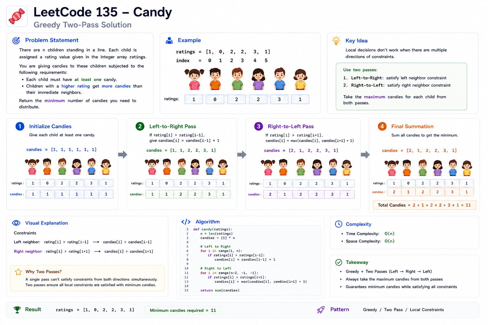
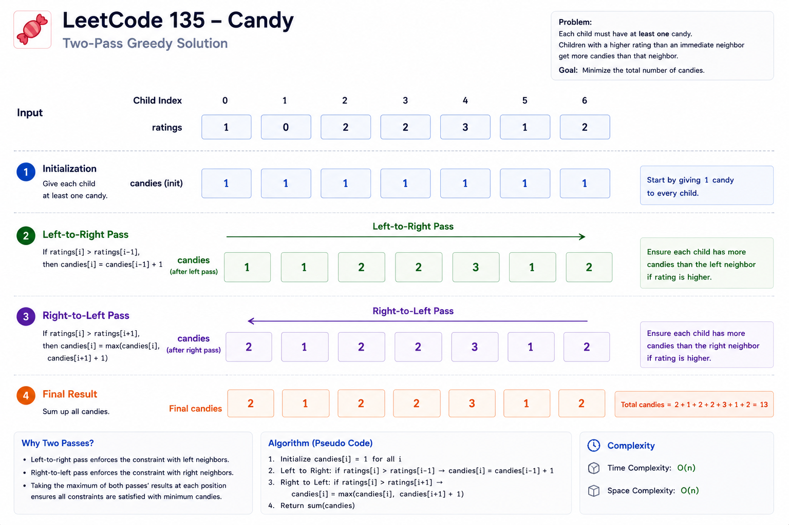
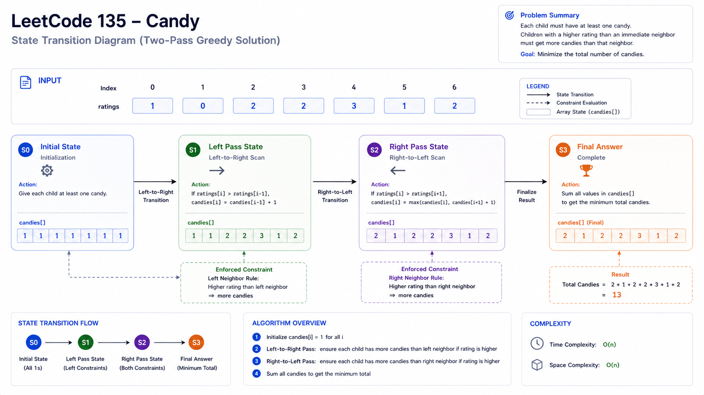
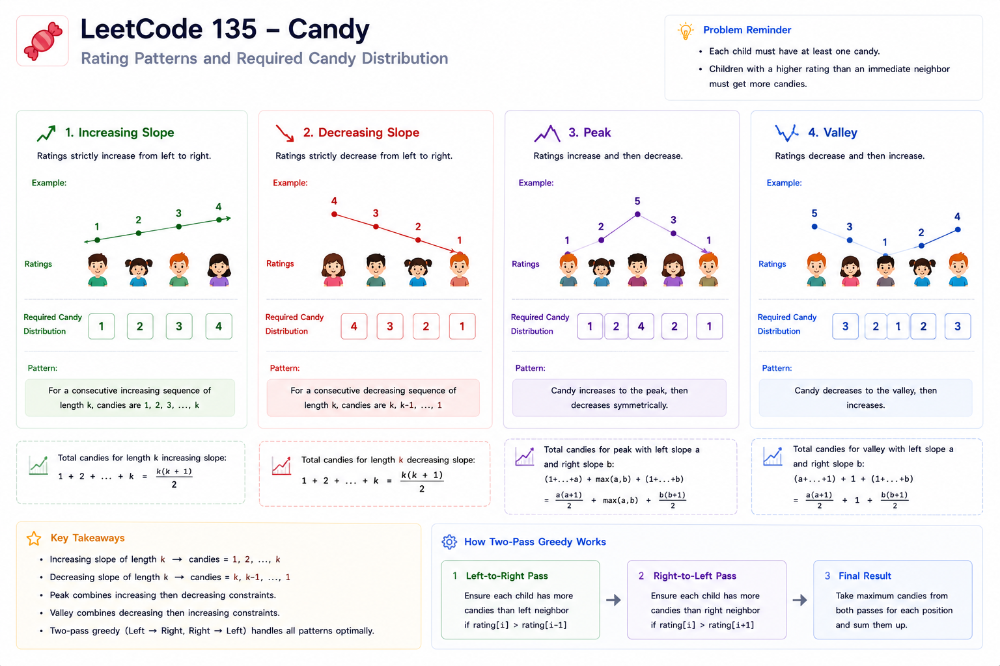
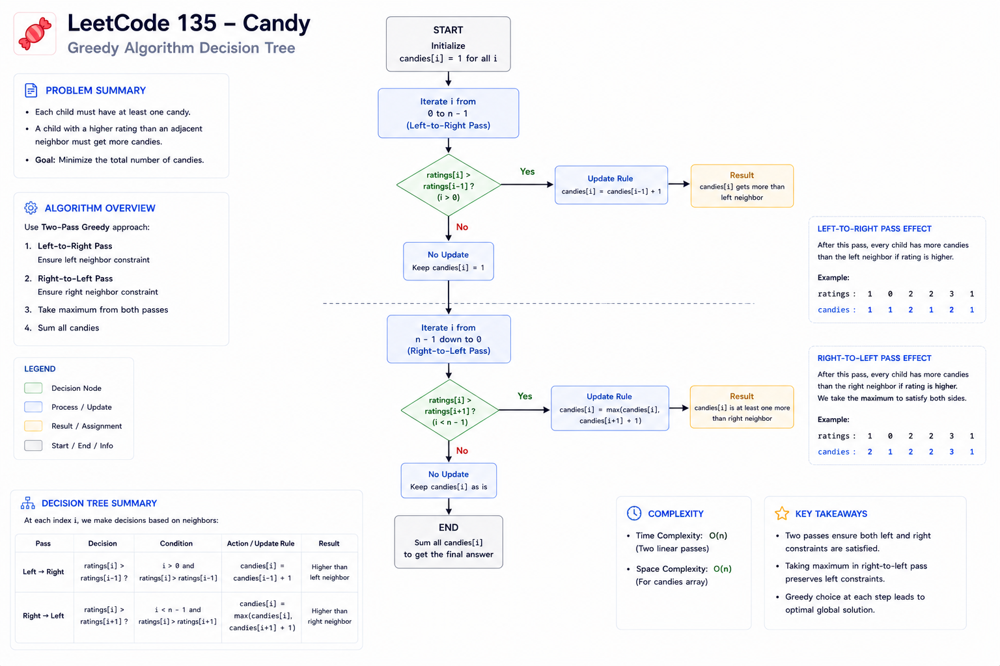

# Candy (135) — Cheat Sheet

## Visual Explanation

### Workflow


### Two-Pass Greedy Visualization


### State Transition Diagram


### Peak and Valley Patterns


### Decision Tree



## Pattern Summary

**Primary Pattern:** Greedy

**Secondary Pattern:** Two-Pass Traversal

**Difficulty:** Hard

**Core Idea:**

When constraints depend on both neighbors, process the array in both directions and combine the requirements.

For Candy:

```text
Left Pass
→ Handle increasing relationships

Right Pass
→ Handle decreasing relationships

Combine
→ Take maximum requirement
```

---

# Recognition Signals

Look for this pattern when the problem contains phrases like:

### Neighbor-Based Constraints

```text
Higher than adjacent element
```

```text
Must be greater than left/right neighbor
```

```text
Local ordering requirement
```

---

### Minimum Resource Allocation

```text
Minimum candies
```

```text
Minimum rewards
```

```text
Minimum units distributed
```

---

### Relative Comparisons

Only ordering matters:

```text
a > b
```

not

```text
a - b
```

---

### Bidirectional Dependencies

If a condition can originate from:

```text
Left Neighbor
```

and

```text
Right Neighbor
```

a two-pass solution is often a strong candidate.

---

# Key Formula

Initialize:

```text
candies[i] = 1
```

---

## Left → Right

```text
if ratings[i] > ratings[i - 1]
    candies[i] = candies[i - 1] + 1
```

---

## Right → Left

```text
if ratings[i] > ratings[i + 1]
    candies[i] =
        max(
            candies[i],
            candies[i + 1] + 1
        )
```

---

## Final Answer

```text
sum(candies)
```

---

# Visual Template

Ratings:

```text
1  0  2
```

Initial:

```text
1  1  1
```

After Left Pass:

```text
1  1  2
```

After Right Pass:

```text
2  1  2
```

Answer:

```text
5
```

---

# Generic Two-Pass Greedy Template

```text
Initialize answer array

Pass #1:
    Process left → right

Pass #2:
    Process right → left

Merge constraints

Compute result
```

---

# Complexity Cheatsheet

## Canonical Solution

| Metric | Complexity |
|----------|----------|
| Time | O(n) |
| Space | O(n) |

---

## Advanced Follow-Up

Slope-based Greedy:

| Metric | Complexity |
|----------|----------|
| Time | O(n) |
| Space | O(1) |

---

# Common Pitfalls

## Mistake #1

Using only one traversal.

Fails for:

```text
[5,4,3,2,1]
```

---

## Mistake #2

Forgetting max().

Wrong:

```text
candies[i] =
candies[i + 1] + 1
```

Correct:

```text
candies[i] =
max(
    candies[i],
    candies[i + 1] + 1
)
```

---

## Mistake #3

Using >= instead of >

Wrong:

```text
ratings[i] >= ratings[i - 1]
```

Correct:

```text
ratings[i] > ratings[i - 1]
```

Equal ratings create no constraint.

---

## Mistake #4

Sorting ratings.

Sorting destroys adjacency information.

The original order is essential.

---

## Mistake #5

Thinking Dynamic Programming Is Required.

This is a Greedy problem.

The optimal solution comes from satisfying local constraints minimally.

---

# Edge Cases Checklist

## Empty Array

```text
[]
```

Expected:

```text
0
```

---

## Single Child

```text
[5]
```

Expected:

```text
1
```

---

## All Equal

```text
[2,2,2]
```

Expected:

```text
3
```

Distribution:

```text
[1,1,1]
```

---

## Strictly Increasing

```text
[1,2,3,4]
```

Distribution:

```text
[1,2,3,4]
```

---

## Strictly Decreasing

```text
[4,3,2,1]
```

Distribution:

```text
[4,3,2,1]
```

---

## Valley

```text
[2,1,2]
```

Distribution:

```text
[2,1,2]
```

---

## Peak

```text
[1,2,3,2,1]
```

Distribution:

```text
[1,2,3,2,1]
```

---

# Interview Recognition Checklist

Ask yourself:

### Does each element depend on neighbors?

✅ Yes

---

### Are constraints directional?

✅ Yes

---

### Must the answer be minimal?

✅ Yes

---

### Can one pass see all constraints?

❌ No

---

### Should I process both directions?

✅ Yes

---

If the answers look like the above, think:

```text
Greedy + Two Pass Traversal
```

---

# Similar Problems

## Same Greedy Mindset

- 55. Jump Game
- 45. Jump Game II
- 134. Gas Station

---

## Neighbor Constraint Problems

- 406. Queue Reconstruction by Height
- 665. Non-decreasing Array
- 2289. Steps to Make Array Non-decreasing

---

## Resource Allocation Problems

- 857. Minimum Cost to Hire K Workers
- 630. Course Schedule III

---

# Quick Revision Notes

### Core Insight

```text
Constraints come from both directions.
```

---

### Solution Strategy

```text
Initialize all to 1

Left → Right
    Handle increasing ratings

Right → Left
    Handle decreasing ratings

Take max requirement

Sum answer
```

---

### Complexity

```text
Time  = O(n)
Space = O(n)
```

---

### Most Important Interview Point

A single traversal cannot satisfy both neighbor constraints.

The optimal solution is achieved by processing:

```text
Left → Right
```

and

```text
Right → Left
```

then preserving both requirements with:

```text
max()
```

Remember this sentence:

> "The left pass satisfies increasing relationships, the right pass satisfies decreasing relationships, and taking the maximum preserves both constraints while maintaining the minimum valid candy assignment."