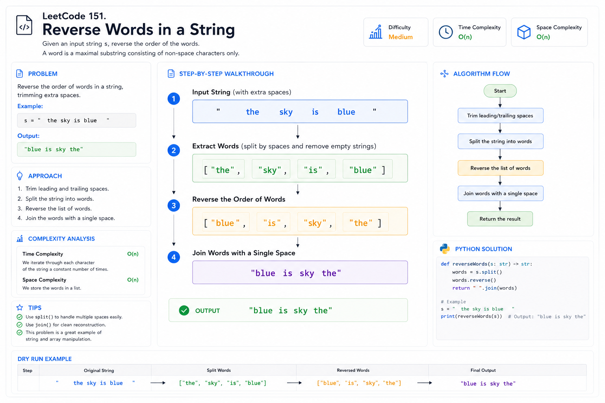

# Reverse Words in a String — Cheat Sheet

## Visual Explanation




## Pattern Summary

### Primary Pattern

**Two Pointers**

### Secondary Pattern

**String Manipulation**

### Difficulty

**Medium**

### LeetCode

**151. Reverse Words in a String**

---

# Recognition Signals

Use this pattern when the problem contains phrases like:

```text
Reverse words
Reverse order of tokens
Sentence transformation
Word rearrangement
Ignore extra spaces
Normalize whitespace
```

Typical examples:

```text
"the sky is blue"
```

↓

```text
"blue is sky the"
```

---

# Core Insight

The problem is NOT:

```text
Reverse characters
```

The problem IS:

```text
Reverse word order
```

Think:

```text
Input String
      ↓
Extract Words
      ↓
Reverse Word Sequence
      ↓
Join With Single Space
```

---

# Mental Model

Imagine every word as a box.

```text
[the] [sky] [is] [blue]
```

Reverse box order:

```text
[blue] [is] [sky] [the]
```

Join:

```text
blue is sky the
```

---

# Solution Template

## Generic Algorithm

```text
1. Extract all valid words
2. Ignore extra spaces
3. Reverse words array
4. Join with one space
```

---

## Pseudocode

```text
words = extractWords(s)

reverse(words)

answer = join(words, " ")

return answer
```

---

# Two-Pointer Reverse Template

```text
left = 0
right = words.length - 1

while left < right:
    swap(words[left], words[right])

    left++
    right--
```

---

# Go Template

```go
words := strings.Fields(s)

left, right := 0, len(words)-1

for left < right {
    words[left], words[right] = words[right], words[left]
    left++
    right--
}

return strings.Join(words, " ")
```

---

# Java Template

```java
String[] words = s.trim().split("\\s+");

int left = 0;
int right = words.length - 1;

while (left < right) {
    String temp = words[left];
    words[left] = words[right];
    words[right] = temp;

    left++;
    right--;
}

return String.join(" ", words);
```

---

# JavaScript Template

```javascript
const words = s.trim().split(/\s+/);

let left = 0;
let right = words.length - 1;

while (left < right) {
    [words[left], words[right]] =
        [words[right], words[left]];

    left++;
    right--;
}

return words.join(" ");
```

---

# Key Formula

### Reverse Array

```text
Swap
arr[left]
arr[right]
```

Until:

```text
left >= right
```

---

# Complexity Cheatsheet

| Operation | Complexity |
|------------|------------|
| Parse String | O(n) |
| Extract Words | O(n) |
| Reverse Words | O(k) |
| Join Result | O(n) |
| Total Time | O(n) |
| Total Space | O(n) |

Where:

```text
n = string length
k = number of words
```

and:

```text
k ≤ n
```

---

# Common Edge Cases

## Empty String

```text
Input:
""

Output:
""
```

---

## Only Spaces

```text
Input:
"     "

Output:
""
```

---

## Single Word

```text
Input:
"hello"

Output:
"hello"
```

---

## Multiple Spaces

```text
Input:
"a   good    example"

Output:
"example good a"
```

---

## Leading Spaces

```text
Input:
"   hello world"

Output:
"world hello"
```

---

## Trailing Spaces

```text
Input:
"hello world   "

Output:
"world hello"
```

---

# Common Mistakes

## Mistake #1

Reversing characters.

Wrong:

```text
eulb si yks eht
```

Correct:

```text
blue is sky the
```

---

## Mistake #2

Keeping extra spaces.

Wrong:

```text
blue  is  sky  the
```

Correct:

```text
blue is sky the
```

---

## Mistake #3

Forgetting trim behavior.

Input:

```text
"  hello world  "
```

Must become:

```text
"world hello"
```

---

## Mistake #4

Ignoring empty tokens.

Example:

```text
split(" ")
```

may create:

```text
["", "", "hello", ""]
```

These should not appear in the result.

---

# Optimization Journey

### Level 1

```text
Store words
Reverse words
Join words
```

Complexity:

```text
O(n) time
O(n) space
```

---

### Level 2

Manual parsing without split()

Useful when interviewers restrict library usage.

---

### Level 3

In-place reversal

Process:

```text
Reverse Entire String
        ↓
Reverse Each Word
        ↓
Clean Spaces
```

Complexity:

```text
O(n) time
O(1) extra space
```

---

# Similar Problems

## Directly Related

| Problem | Pattern |
|----------|----------|
| 58. Length of Last Word | String Traversal |
| 344. Reverse String | Two Pointers |
| 541. Reverse String II | String Reversal |
| 557. Reverse Words in a String III | Word Reversal |
| 186. Reverse Words in a String II | In-Place Reversal |

---

## Same String-Manipulation Family

| Problem | Topic |
|----------|----------|
| 125 | Valid Palindrome |
| 680 | Valid Palindrome II |
| 28 | Find the Index of First Occurrence |
| 14 | Longest Common Prefix |

---

# Interview Sound Bite

A concise explanation:

> The key insight is that we reverse the order of words, not the characters. I first extract all valid words while ignoring extra spaces, then reverse the word sequence and join them using a single space. This gives an O(n) time and O(n) space solution.

---

# One-Minute Revision

```text
Pattern:
Two Pointers + String Manipulation

Goal:
Reverse word order

Steps:
Extract Words
Reverse Array
Join Words

Complexity:
Time  O(n)
Space O(n)

Most Common Follow-Up:
Can you do it in O(1) extra space?

Related:
58, 186, 344, 541, 557
```