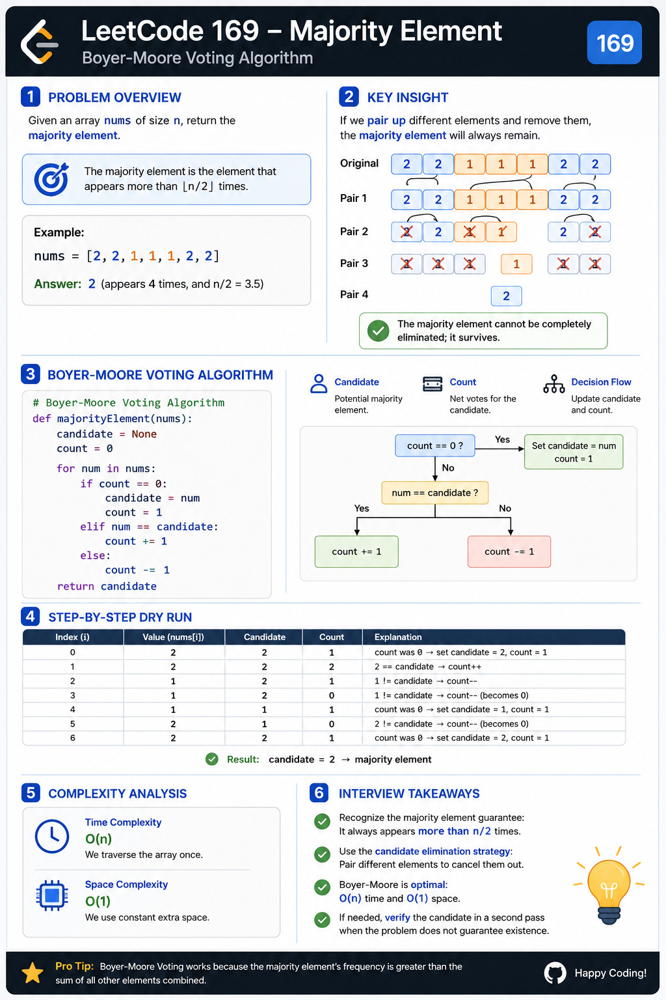

# Majority Element — Cheat Sheet

## Visual Overview




## Pattern Summary

### Pattern Name

**Boyer-Moore Voting Algorithm**

### Core Idea

When an element appears more than half the time:

```text
frequency > n/2
```

it survives all pairwise cancellations with other elements.

The algorithm maintains:

```text
candidate
count
```

and continuously cancels conflicting values.

---

## Recognition Signals

Use Boyer-Moore when you see:

### Signal 1

Problem asks:

```text
Majority Element
```

or

```text
Most Frequent Element
```

with a guarantee of dominance.

---

### Signal 2

Constraint includes:

```text
Appears more than n/2 times
```

---

### Signal 3

Follow-up asks:

```text
Can you solve in O(1) extra space?
```

---

### Signal 4

Need:

```text
O(n) Time
O(1) Space
```

---

### Signal 5

Problem guarantees answer exists.

This is often the clue that enables Boyer-Moore.

---

## Key Formula

### Majority Condition

:contentReference[oaicite:0]{index=0}

---

### Cancellation Principle

Let:

```text
M = Majority Count
O = Other Counts
```

Condition:

```text
M > O
```

After maximum pair cancellations:

```text
M - O > 0
```

Majority element survives.

---

## Boyer-Moore Template

### Generic Template

```java
int candidate = 0;
int count = 0;

for (int num : nums) {

    if (count == 0) {
        candidate = num;
    }

    if (num == candidate) {
        count++;
    } else {
        count--;
    }
}

return candidate;
```

---

## Candidate Selection Rules

### Rule 1

If:

```text
count == 0
```

Choose a new candidate.

---

### Rule 2

If:

```text
num == candidate
```

Increase vote.

```text
count++
```

---

### Rule 3

If:

```text
num != candidate
```

Cancel vote.

```text
count--
```

---

## Complexity Cheatsheet

| Approach | Time | Space |
|-----------|--------|--------|
| Brute Force | O(n²) | O(1) |
| Hash Map | O(n) | O(n) |
| Sorting | O(n log n) | O(1) |
| Boyer-Moore | O(n) | O(1) |

---

## Quick Dry Run

Input:

```text
[2,2,1,1,1,2,2]
```

| Value | Candidate | Count |
|---------|---------|---------|
| 2 | 2 | 1 |
| 2 | 2 | 2 |
| 1 | 2 | 1 |
| 1 | 2 | 0 |
| 1 | 1 | 1 |
| 2 | 1 | 0 |
| 2 | 2 | 1 |

Result:

```text
2
```

---

## Common Pitfalls

### Pitfall 1

Resetting candidate incorrectly.

Wrong:

```java
if (count < 0)
```

Correct:

```java
if (count == 0)
```

---

### Pitfall 2

Forgetting majority guarantee.

LeetCode 169 guarantees:

```text
Majority element exists.
```

No verification pass needed.

---

### Pitfall 3

Confusing candidate with answer during traversal.

Candidate may change multiple times.

Only the final candidate matters.

---

### Pitfall 4

Using HashMap immediately.

HashMap works but misses the optimal solution.

---

## Interview Roadmap

Expected progression:

```text
Brute Force
    ↓
Hash Map
    ↓
Boyer-Moore Voting
```

Always explain:

```text
Why cancellation works
```

not just:

```text
How the code works
```

---

## Similar Problems

### Directly Related

| Problem | Pattern |
|-----------|-----------|
| 169. Majority Element | Boyer-Moore |
| 229. Majority Element II | Extended Boyer-Moore |
| 347. Top K Frequent Elements | Frequency Counting |
| 451. Sort Characters by Frequency | Frequency Counting |

---

### Array Frequency Problems

- 217. Contains Duplicate
- 219. Contains Duplicate II
- 1207. Unique Number of Occurrences

---

### Advanced Voting Variants

- Majority Element II
- Majority Element III (generalized)
- N/K Frequency Problems

---

## One-Minute Revision

### Remember

```text
Majority Element > n/2
```

### Key Insight

```text
Majority Count > All Other Counts Combined
```

### Data Needed

```text
candidate
count
```

### Transition Rules

```text
count == 0
    → choose candidate

same value
    → count++

different value
    → count--
```

### Complexity

```text
Time  : O(n)
Space : O(1)
```

### Interview Trigger

Whenever you see:

```text
Appears more than half the time
```

Think:

```text
Boyer-Moore Voting Algorithm
```