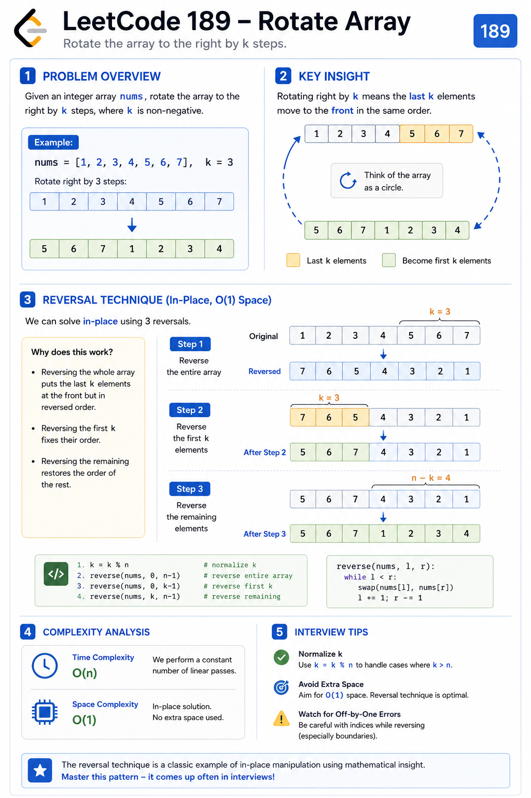
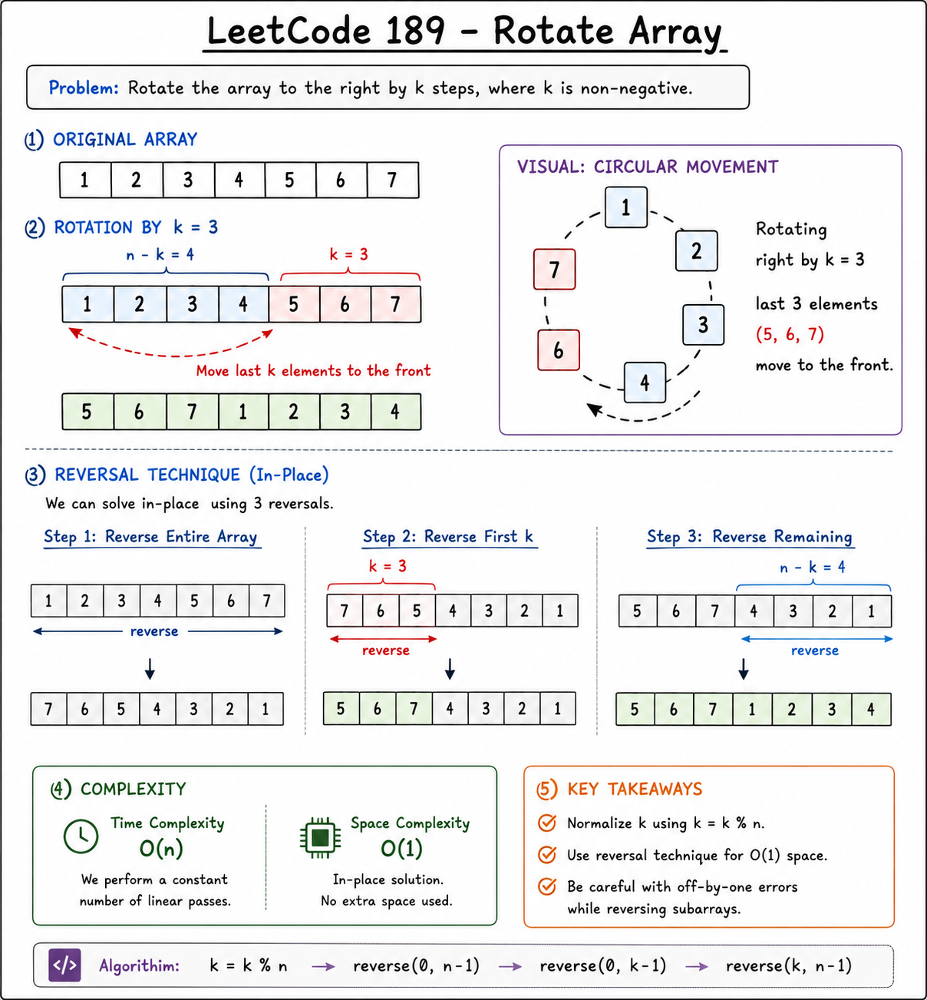
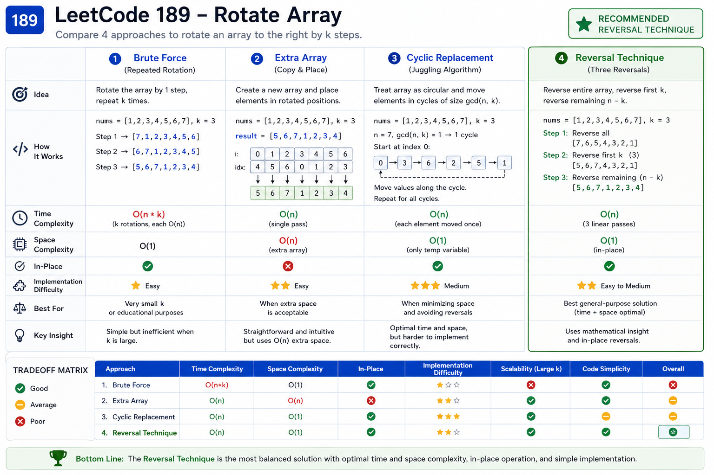
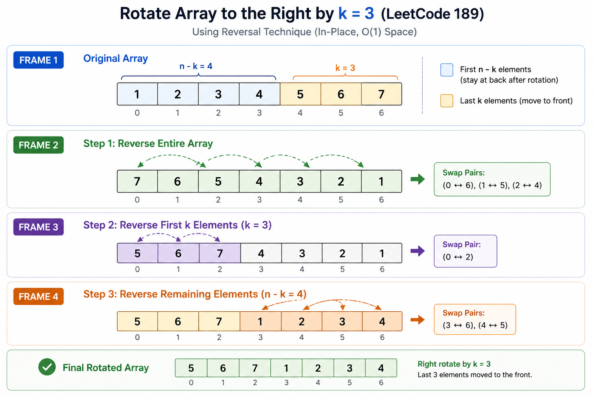
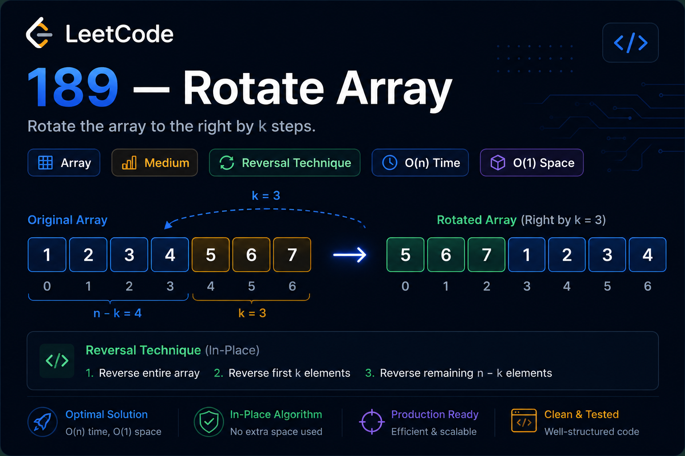

# Rotate Array (LeetCode 189) — Cheat Sheet


## Visual Overview








## Pattern Summary

### Primary Pattern

Array Manipulation

### Secondary Pattern

Reversal Technique

### Difficulty

Medium

### Core Idea

Rotate the array to the right by `k` positions using three reversals:

1. Reverse entire array
2. Reverse first `k` elements
3. Reverse remaining elements

---

## Recognition Signals

Look for this pattern when the problem contains phrases like:

### Keywords

- Rotate Array
- Shift Elements
- Circular Movement
- Move Last k Elements
- In-Place Rearrangement
- Right Rotation
- Left Rotation

---

### Typical Constraints

```text
Can you do it in-place?
```

```text
O(1) extra space?
```

```text
Array length up to 10^5
```

These usually indicate that a brute-force solution is not expected.

---

### Visual Signal

```text
Original

[1,2,3,4,5,6,7]

Rotate Right by 3

[5,6,7,1,2,3,4]
```

Notice:

```text
Last k elements move to front
```

This is the key observation.

---

## Key Formula

### Normalize Rotation

```text
k = k % n
```

Always perform this first.

Example:

```text
n = 7
k = 10

k = 10 % 7 = 3
```

---

### Target Position Formula

Used in auxiliary-array solutions:

```text
newIndex = (i + k) % n
```

---

## Reversal Technique Formula

Remember:

```text
Rotate Right
=
Reverse Whole Array
+
Reverse First k Elements
+
Reverse Remaining Elements
```

---

### Template

```text
reverse(0, n - 1)

reverse(0, k - 1)

reverse(k, n - 1)
```

---

## Visual Memory Trick

### Before Rotation

```text
[1,2,3,4 | 5,6,7]
```

Desired:

```text
[5,6,7 | 1,2,3,4]
```

---

### Reverse Entire Array

```text
[7,6,5 | 4,3,2,1]
```

---

### Reverse First Group

```text
[5,6,7 | 4,3,2,1]
```

---

### Reverse Second Group

```text
[5,6,7 | 1,2,3,4]
```

Done.

---

## Complexity Cheatsheet

| Approach | Time | Space |
|-----------|--------|--------|
| Repeated Shift | O(n × k) | O(1) |
| Extra Array | O(n) | O(n) |
| Cyclic Replacement | O(n) | O(1) |
| Reversal Technique | O(n) | O(1) |

---

### Interview Preferred

✅ Reversal Technique

Because:

```text
O(n) Time
O(1) Space
```

and easy to explain.

---

## Common Pitfalls

### Forgetting Modulo

Wrong:

```text
k = 1000000
```

Correct:

```text
k %= n
```

---

### Wrong Reverse Order

Correct sequence:

```text
reverse(all)

reverse(first k)

reverse(remaining)
```

Changing the order breaks the solution.

---

### Off-by-One Errors

Correct:

```text
reverse(0, k - 1)

reverse(k, n - 1)
```

Not:

```text
reverse(0, k)

reverse(k + 1, n - 1)
```

---

### Not Handling k = 0

Example:

```text
nums = [1,2,3]
k = 0
```

Output should remain unchanged.

---

### Ignoring Small Arrays

```text
[]
```

```text
[1]
```

Should not cause failures.

---

## Quick Recognition Checklist

Before coding ask:

### 1

Is this a circular movement problem?

✅ Yes

---

### 2

Do elements wrap around the array?

✅ Yes

---

### 3

Is O(1) space required?

✅ Yes

---

### 4

Can the array be transformed using reversals?

✅ Yes

---

If all answers are yes:

```text
Think Reversal Technique
```

---

## Similar Problems

### Easy

#### 26. Remove Duplicates from Sorted Array

Pattern:

```text
Two Pointers
```

---

#### 27. Remove Element

Pattern:

```text
Array Manipulation
```

---

#### 88. Merge Sorted Array

Pattern:

```text
In-Place Merge
```

---

### Medium

#### 48. Rotate Image

Pattern:

```text
Matrix Rotation
Reversal
Transpose
```

---

#### 280. Wiggle Sort

Pattern:

```text
Array Rearrangement
```

---

#### 189. Rotate Array

Pattern:

```text
Reversal Technique
```

---

### Advanced

#### Circular Array Loop

Pattern:

```text
Cycle Detection
Circular Movement
```

---

#### Shift 2D Grid

Pattern:

```text
Rotation
Index Mapping
```

---

## Quick Revision Notes

### Problem Goal

Move array elements right by `k` positions.

---

### First Step

```text
k %= n
```

---

### Optimal Algorithm

```text
reverse(all)

reverse(first k)

reverse(rest)
```

---

### Complexity

```text
Time  = O(n)

Space = O(1)
```

---

### Most Important Insight

```text
Last k elements
become
First k elements
```

Reversal allows this transformation to happen in-place.

---

### Interview One-Liner

> Rotate the array in-place by reversing the entire array, then reversing the first k elements and the remaining elements separately. This achieves O(n) time and O(1) extra space.

---

## 30-Second Revision

```text
Problem:
Rotate array right by k.

Step 1:
k %= n

Step 2:
Reverse entire array

Step 3:
Reverse first k elements

Step 4:
Reverse remaining elements

Complexity:
O(n) Time
O(1) Space

Pattern:
Array Manipulation + Reversal Technique
```

### Memorization Formula

```text
Rotate Right

↓

Reverse All

↓

Reverse First k

↓

Reverse Rest
```

If you remember only one thing from this problem, remember that formula.