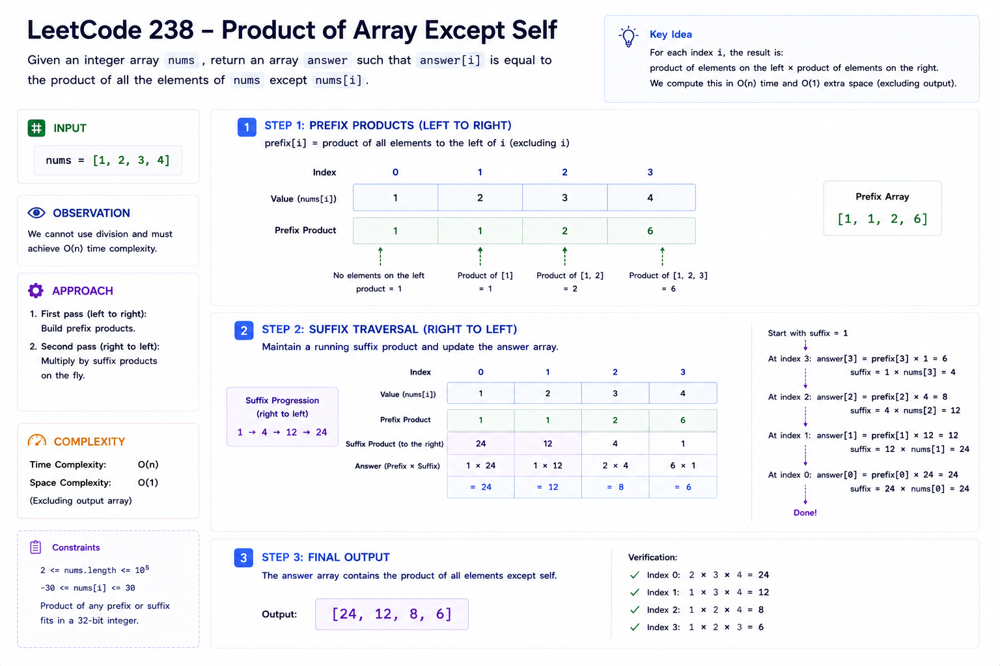
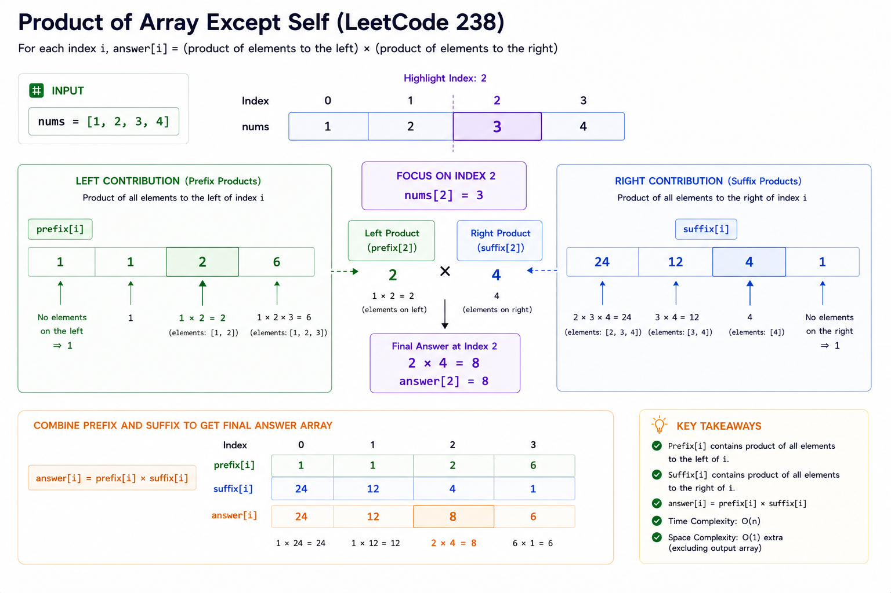
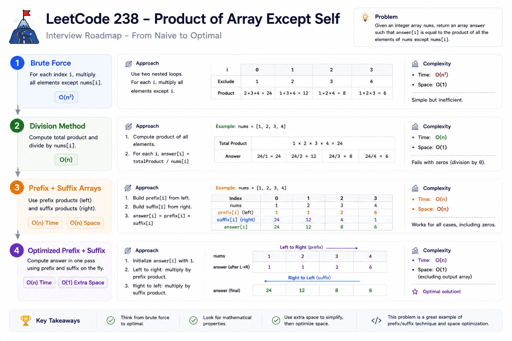
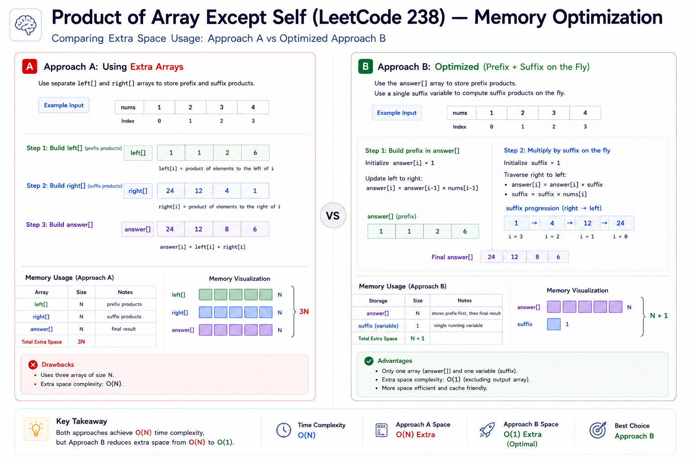

# Product of Array Except Self — Cheat Sheet

## Visual Overview

### Product Except Self Overview


### Prefix Suffix Products


### Optimization Journey


### Space Optimization



## Pattern Summary

### Primary Pattern

**Prefix Product**

### Secondary Pattern

**Suffix Product**

### Optimization Pattern

**Space-Optimized Prefix/Suffix Traversal**

---

## Recognition Signals

Look for this pattern when you see phrases like:

✅ "For each index, calculate something using all other elements"

✅ "Need information from both left and right sides"

✅ "Without using division"

✅ "Return result for every position"

✅ "Compute aggregate excluding current element"

✅ "Optimize from O(n²) to O(n)"

---

### Common Problem Shape

```text id="h6jtnj"
answer[i] =
(left contribution)
×
(right contribution)
```

Examples:

```text id="jpn2vb"
Product Except Self
Rain Water
Pivot Index
Range Queries
```

---

## Key Formula

For every index `i`:

```text id="6v4z1k"
answer[i]
=
prefixProduct[i]
×
suffixProduct[i]
```

Where:

```text id="25k1ml"
prefixProduct[i]
=
product of elements before i
```

and

```text id="xtiz4x"
suffixProduct[i]
=
product of elements after i
```

---

### Visual Formula

```text id="7yjk2z"
nums:

[1, 2, 3, 4]

Index 2:

Left Product:
1 × 2 = 2

Right Product:
4

Answer:
2 × 4 = 8
```

---

## Optimal Template

### Generic Prefix + Suffix Pattern

```text id="z93xjz"
result[0] = identity

for i from 1 to n-1:
    result[i] =
        result[i-1] * nums[i-1]

suffix = identity

for i from n-1 down to 0:
    result[i] *= suffix
    suffix *= nums[i]
```

---

### Product Version

Identity value:

```text id="tov1j9"
1
```

because:

```text id="sffr8s"
1 × x = x
```

---

### Sum Version

Identity value:

```text id="8z3p34"
0
```

because:

```text id="e2rlmy"
0 + x = x
```

---

## Complexity Cheatsheet

| Approach                  | Time  | Space | Interview Rating |
| ------------------------- | ----- | ----- | ---------------- |
| Brute Force               | O(n²) | O(1)  | Poor             |
| Division                  | O(n)  | O(1)  | Rejected         |
| Prefix + Suffix Arrays    | O(n)  | O(n)  | Good             |
| Optimized Prefix + Suffix | O(n)  | O(1)  | Excellent        |

---

## Optimization Journey

```text id="quqr7f"
Brute Force
      ↓
Division
      ↓
Prefix Array + Suffix Array
      ↓
Reuse Output Array
      ↓
O(1) Extra Space
```

Interviewers often expect this exact progression.

---

## Prefix Pass Cheat Sheet

Purpose:

```text id="0s8t6h"
Store all left-side products
```

Example:

```text id="js7vbj"
nums:

[1,2,3,4]
```

Build:

| Index | Prefix Product |
| ----- | -------------- |
| 0     | 1              |
| 1     | 1              |
| 2     | 2              |
| 3     | 6              |

Result:

```text id="59u6vx"
[1,1,2,6]
```

---

## Suffix Pass Cheat Sheet

Start:

```text id="07pqzi"
suffix = 1
```

Traverse:

```text id="c41c1g"
right → left
```

Update order:

```text id="m8xr0n"
result[i] *= suffix

suffix *= nums[i]
```

⚠️ Never reverse these two statements.

---

## Memory Trick

Instead of:

```text id="w3t0sz"
left[]
right[]
answer[]
```

Use:

```text id="j21g9o"
answer[]
suffix
```

Memory improves from:

```text id="7drg6h"
O(n)
```

to:

```text id="0m8z4d"
O(1)
```

extra space.

---

## Edge Cases

### Empty Array

```text id="2rj8yq"
[]
```

Output:

```text id="lrz03e"
[]
```

---

### Single Element

```text id="b7hprl"
[5]
```

Output:

```text id="f8j7eh"
[1]
```

---

### One Zero

```text id="z80sdw"
[1,2,0,4]
```

Output:

```text id="j0h4hl"
[0,0,8,0]
```

---

### Multiple Zeros

```text id="l3v5o9"
[1,0,2,0]
```

Output:

```text id="4b75n4"
[0,0,0,0]
```

---

### Negative Numbers

```text id="sazkpo"
[-1,2,-3]
```

Output:

```text id="mjlwmv"
[-6,3,-2]
```

---

## Common Mistakes

### Mistake #1

Using division.

```text id="m9epqf"
totalProduct / nums[i]
```

❌ Violates constraints.

---

### Mistake #2

Wrong initialization.

Wrong:

```text id="szq0hf"
result[0] = nums[0]
```

Correct:

```text id="58m38v"
result[0] = 1
```

---

### Mistake #3

Wrong suffix update order.

Wrong:

```text id="1xkew4"
suffix *= nums[i]

result[i] *= suffix
```

Correct:

```text id="sl2s1q"
result[i] *= suffix

suffix *= nums[i]
```

---

### Mistake #4

Counting output array as extra space.

LeetCode rule:

```text id="owj2ea"
Output array
does NOT count
toward extra space.
```

---

## Similar Problems

### Directly Related

* 238. Product of Array Except Self
* 152. Maximum Product Subarray
* 42. Trapping Rain Water
* 724. Find Pivot Index

---

### Prefix/Suffix Family

* 303. Range Sum Query
* 560. Subarray Sum Equals K
* 974. Subarray Sums Divisible by K
* 525. Contiguous Array

---

### Advanced Extensions

* Segment Tree Problems
* Range Product Queries
* Dynamic Prefix/Suffix Queries
* Distributed Aggregation Systems

---

## Quick Revision Notes

### Core Insight

```text id="zdt6tv"
answer[i]
=
left product
×
right product
```

---

### Prefix Pass

```text id="8h3md8"
Store left products
```

---

### Suffix Pass

```text id="epjlwm"
Multiply right products
```

---

### Optimal Code Pattern

```text id="o7vay4"
result[0] = 1

Forward:
    build prefixes

suffix = 1

Backward:
    inject suffixes
```

---

### Complexity

```text id="uqbmsk"
Time  : O(n)
Space : O(1)
```

---

### Interview One-Liner

```text id="r7eaqv"
For each index,
the answer equals the product
of all elements on the left
multiplied by the product
of all elements on the right.
```

This observation directly leads to the optimal prefix/suffix solution.

---

**PHASE 6 Complete.**

Reply with **Next** to continue to **PHASE 7 — Diagrams & Visuals**.
