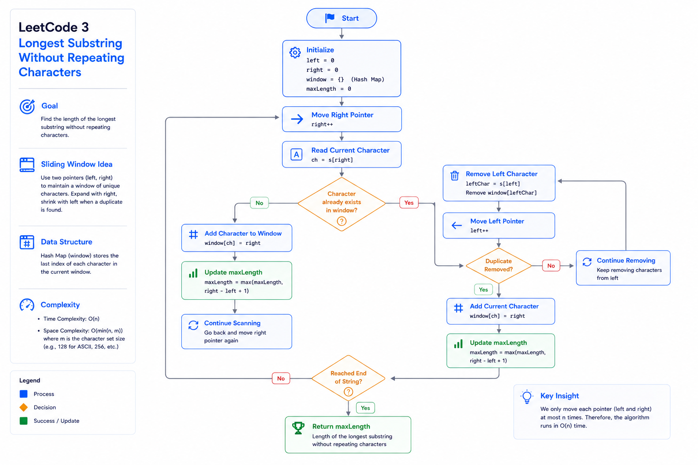

# LeetCode 3 — Longest Substring Without Repeating Characters

## Visual Overview



# Pattern Summary

## Primary Pattern

✅ Sliding Window

## Secondary Patterns

- Two Pointers
- Hash Set
- Hash Map
- String Processing

---

# Recognition Signals

If a problem contains phrases like:

- Longest substring
- Shortest substring
- Contiguous sequence
- Continuous subarray
- No repeating elements
- Unique characters
- At most K
- Exactly K
- Expand and shrink

➡️ Think **Sliding Window**.

---

# Core Idea

Maintain a window that always satisfies the problem constraint.

For this problem:

> **Every character inside the window must be unique.**

Whenever a duplicate appears:

1. Shrink the window.
2. Remove elements from the left.
3. Restore validity.
4. Continue expanding.

---

# Window Invariant

```
Current Window

+----------------------+
| No Duplicate Allowed |
+----------------------+
```

Invariant:

```
All characters are unique.
```

---

# Sliding Window Template

## HashSet Version

```text
Initialize:

left = 0
maxLength = 0
window = empty set

for right in range:

    while current character exists:

        remove left character

        left++

    add current character

    update answer
```

---

## HashMap Version (Optimized)

```text
left = max(left, lastSeen[current] + 1)

update lastSeen

update answer
```

This avoids removing characters one by one.

---

# Algorithm Flow

```
Start

↓

Move Right Pointer

↓

Character Already Exists?

↓

No
│
├── Add Character
│
└── Update Answer

↓

Yes
│
├── Remove Left Character
├── Move Left Pointer
└── Repeat Until Unique

↓

Continue

↓

End
```

---

# Recognition Checklist

Before coding, ask:

- Is this a substring problem?
- Is it contiguous?
- Do I need the longest or shortest answer?
- Can I maintain a valid window?
- Can two pointers solve it?
- Can a HashSet or HashMap track the current state?

If most answers are **Yes**, Sliding Window is likely the correct approach.

---

# Key Formula

Window Length

```text
currentLength = right - left + 1
```

Update Maximum

```text
maxLength = max(maxLength, currentLength)
```

---

# Complexity Cheatsheet

| Approach | Time | Space |
|----------|------|-------|
| Brute Force | O(n²)–O(n³) | O(n) |
| Sliding Window + HashSet | O(n) | O(min(n, charset)) |
| Sliding Window + HashMap | O(n) | O(min(n, charset)) |

---

# Data Structure Comparison

| Data Structure | Purpose | Pros | Cons |
|---------------|---------|------|------|
| HashSet | Track unique characters | Simple and intuitive | May require multiple removals |
| HashMap | Store last seen index | Direct pointer jumps | Slightly more complex |
| Array (ASCII only) | Fixed-size lookup | Very fast | Limited to known character set |

---

# Common Mistakes

❌ Forgetting to remove characters from the HashSet.

❌ Updating the answer before restoring the window.

❌ Resetting the entire window when a duplicate appears.

❌ Using nested loops unnecessarily.

❌ Calculating window size as:

```text
right - left
```

Correct formula:

```text
right - left + 1
```

---

# Edge Cases

| Input | Output |
|-------|-------:|
| `""` | 0 |
| `"a"` | 1 |
| `"aaaa"` | 1 |
| `"abcdef"` | 6 |
| `"abcabcbb"` | 3 |
| `"bbbbb"` | 1 |
| `"pwwkew"` | 3 |
| `"dvdf"` | 3 |

---

# Dry Run Snapshot

Input

```text
abcabcbb
```

| Right | Window | Max |
|------:|--------|----:|
| a | a | 1 |
| b | ab | 2 |
| c | abc | 3 |
| a | bca | 3 |
| b | cab | 3 |
| c | abc | 3 |
| b | cb | 3 |
| b | b | 3 |

Final Answer

```text
3
```

---

# Optimization Journey

```text
Brute Force
      │
      ▼
Generate All Substrings
      │
      ▼
Observe Overlap
      │
      ▼
Sliding Window
      │
      ▼
HashSet
      │
      ▼
HashMap Optimization
```

---

# Similar Problems

## Easy

- 643. Maximum Average Subarray I
- 485. Max Consecutive Ones

---

## Medium

- 209. Minimum Size Subarray Sum
- 567. Permutation in String
- 438. Find All Anagrams in a String
- 424. Longest Repeating Character Replacement
- 904. Fruit Into Baskets
- 1004. Max Consecutive Ones III

---

## Hard

- 76. Minimum Window Substring
- 30. Substring with Concatenation of All Words

---

# Interview Sound Bites

> "The window invariant is that every character is unique."

> "Each pointer only moves forward, giving linear time complexity."

> "Each character enters and leaves the window at most once."

> "HashSet provides O(1) average-time membership checks."

> "A HashMap can further optimize pointer movement by storing the last seen index."

---

# Quick Revision Notes

- ✔ Recognize contiguous substring problems.
- ✔ Think Sliding Window before nested loops.
- ✔ Use two pointers (`left` and `right`).
- ✔ Maintain a valid window at all times.
- ✔ Shrink only when the constraint is violated.
- ✔ Update the answer after restoring the invariant.
- ✔ Remember `right - left + 1`.
- ✔ Time Complexity: **O(n)**
- ✔ Space Complexity: **O(min(n, charset))**
- ✔ Know both **HashSet** and **HashMap** approaches for interviews.

---

## Pattern Memory Hook

> **"Expand → Validate → Shrink → Update → Repeat"**

This five-step cycle is the essence of most Sliding Window problems.