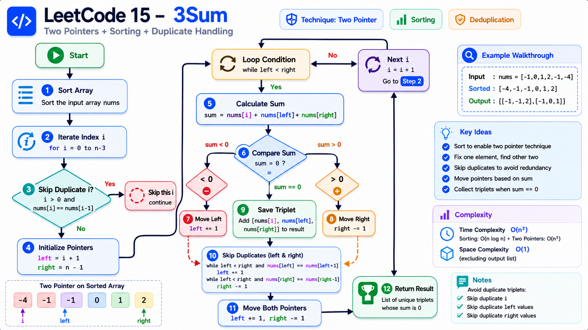
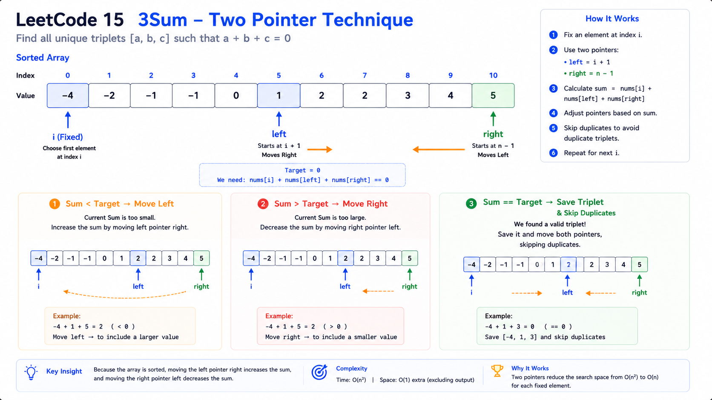
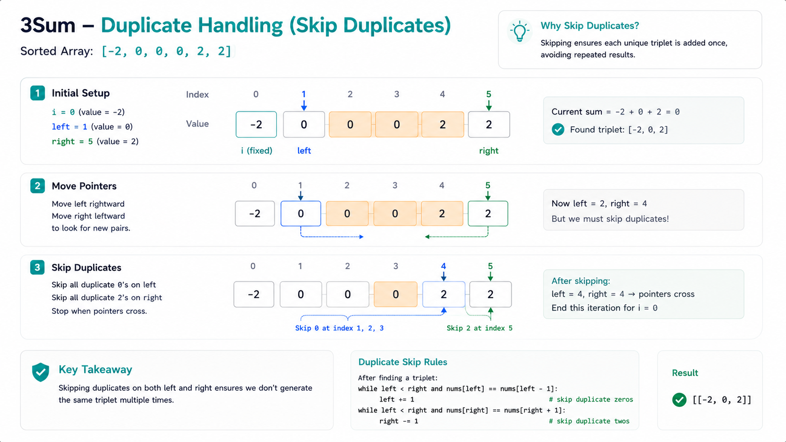
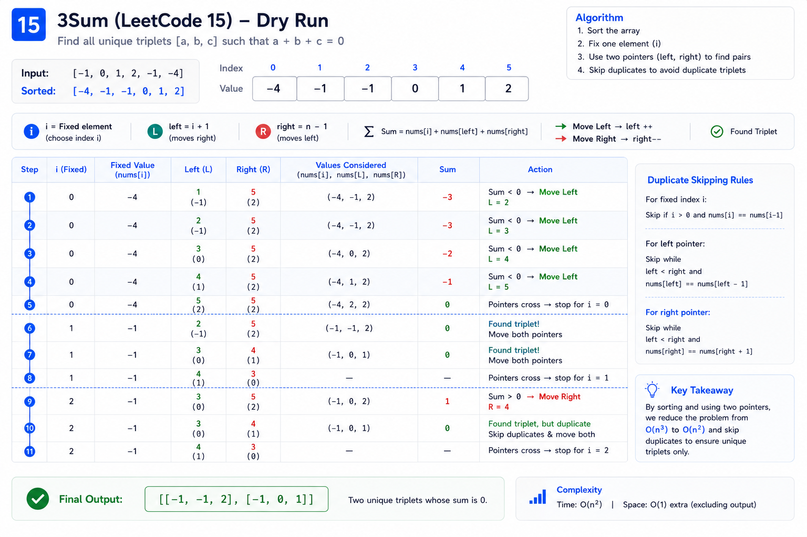
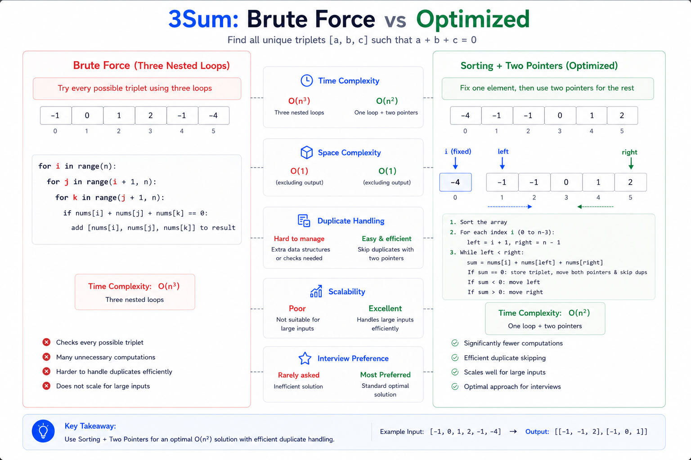

# 15. 3Sum — Cheat Sheet

## Visual Overview



## Two Pointer Visualization



## Duplicate Handling



## Dry Run Illustration



## Complexity Comparison




---

# Pattern Summary

## Core Idea

Transform the **3Sum** problem into multiple **2Sum** problems.

1. Sort the array.
2. Fix one element.
3. Use two pointers to find the remaining two numbers.
4. Skip duplicates to ensure unique triplets.

```text
3Sum

↓

Sort

↓

Fix One Element

↓

Two Pointers

↓

Unique Triplets
```

---

# Recognition Signals

Use this pattern when you see:

- ✔️ Array input
- ✔️ Find triplets/pairs with a target sum
- ✔️ Need **unique combinations**
- ✔️ Order of elements does not matter
- ✔️ Constraints suggest `O(n²)` is acceptable
- ✔️ Brute force would require three nested loops

### Common Keywords

- "Find all triplets"
- "Unique triplets"
- "Sum equals target"
- "No duplicate answers"
- "Array"
- "Combination"

---

# Algorithm Template

```text
Sort the array

for each index i

    Skip duplicate fixed elements

    left = i + 1
    right = n - 1

    while left < right

        sum = nums[i] + nums[left] + nums[right]

        if sum < target
            left++

        else if sum > target
            right--

        else
            Save answer

            left++
            right--

            Skip duplicate left values

            Skip duplicate right values
```

---

# Pointer Movement Rules

| Condition | Action | Reason |
|-----------|--------|--------|
| `sum < target` | `left++` | Increase the sum |
| `sum > target` | `right--` | Decrease the sum |
| `sum == target` | Save triplet, move both pointers | Continue searching for unique answers |

---

# Duplicate Handling Checklist

## 1. Fixed Element

```java
if (i > 0 && nums[i] == nums[i - 1])
    continue;
```

Avoid processing the same starting value more than once.

---

## 2. Left Pointer

After recording a triplet:

```java
left++;

while (left < right && nums[left] == nums[left - 1])
    left++;
```

Skip repeated left values.

---

## 3. Right Pointer

```java
right--;

while (left < right && nums[right] == nums[right + 1])
    right--;
```

Skip repeated right values.

---

# Key Formula

For a fixed index `i`:

```text
nums[i] + nums[left] + nums[right] = target
```

For the original problem:

```text
target = 0
```

Equivalent form:

```text
nums[left] + nums[right] = target - nums[i]
```

This highlights that 3Sum reduces to a 2Sum search after fixing one element.

---

# Complexity Cheatsheet

| Approach | Time | Space | Notes |
|----------|------|-------|-------|
| Brute Force | O(n³) | O(1) | Checks every triplet |
| Sorting + Two Pointers | O(n²) | O(1) | Optimal interview solution |
| Hash Set per Fixed Element | O(n²) | O(n) | Simpler inner lookup but more memory |

### Complexity Breakdown

```text
Sorting          → O(n log n)

Outer Loop       → O(n)

Two Pointer Scan → O(n)

Overall          → O(n²)
```

---

# Common Pitfalls

### ❌ Forgetting to Sort

Two pointers rely on sorted order.

---

### ❌ Not Skipping Duplicate Fixed Elements

Produces duplicate triplets.

---

### ❌ Not Skipping Duplicate Pointer Values

Same triplet may appear multiple times.

---

### ❌ Moving the Wrong Pointer

```text
sum < target

Move LEFT
```

```text
sum > target

Move RIGHT
```

---

### ❌ Using Three Nested Loops

Correct but fails performance constraints.

---

# Edge Case Checklist

| Input | Expected Output |
|-------|-----------------|
| `[]` | `[]` |
| `[1]` | `[]` |
| `[1,2]` | `[]` |
| `[0,0,0]` | `[[0,0,0]]` |
| `[1,2,3]` | `[]` |
| `[-1,0,1]` | `[[-1,0,1]]` |
| `[-1,-1,2]` | `[[-1,-1,2]]` |
| `[-2,0,0,2,2]` | `[[-2,0,2]]` |

---

# Pattern Recognition Flow

```text
Need all triplets?
        │
        ▼
Brute Force = O(n³)
        │
        ▼
Can sorting help?
        │
       Yes
        │
        ▼
Fix one element
        │
        ▼
Need remaining pair
        │
        ▼
Use Two Pointers
        │
        ▼
Skip duplicates
        │
        ▼
Return unique triplets
```

---

# Similar Problems

| LeetCode | Problem | Pattern |
|----------|---------|---------|
| 1 | Two Sum | Hash Map |
| 11 | Container With Most Water | Two Pointers |
| 15 | 3Sum | Sorting + Two Pointers |
| 16 | 3Sum Closest | Sorting + Two Pointers |
| 18 | 4Sum | Nested Loops + Two Pointers |
| 167 | Two Sum II | Two Pointers |
| 259 | 3Sum Smaller | Two Pointers |
| 454 | 4Sum II | Hash Map |
| k-Sum | Generalized k-Sum | Recursion + Two Pointers |

---

# Interview Talking Points

When explaining your solution:

1. Start with the brute-force approach (`O(n³)`).
2. Explain that sorting enables ordered pointer movement.
3. Reduce the problem to repeated 2Sum searches.
4. Justify each pointer movement.
5. Explain duplicate handling clearly.
6. Conclude with `O(n²)` time and `O(1)` auxiliary space.

---

# Quick Revision Notes

### Remember the Recipe

```text
Sort
 ↓
Fix i
 ↓
Left = i + 1
Right = n - 1
 ↓
Compute Sum
 ↓
< target  → Left++
> target  → Right--
== target → Save
 ↓
Skip duplicates
 ↓
Repeat
```

### Mental Model

```text
One fixed number

+

Two moving pointers

=

One unique triplet
```

### One-Line Summary

> **Sort the array, fix one element, solve the remaining problem with Two Pointers, and skip duplicates to generate all unique triplets in O(n²).**