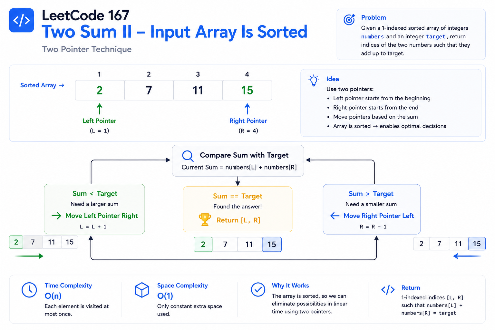

# LeetCode 167 — Two Sum II (Input Array Is Sorted)

## Visual Overview




---

# Pattern Summary

| Property              | Value                                   |
| --------------------- | --------------------------------------- |
| **Primary Pattern**   | Two Pointers                            |
| **Secondary Pattern** | Sorted Array                            |
| **Difficulty**        | Easy                                    |
| **Time Complexity**   | O(n)                                    |
| **Space Complexity**  | O(1)                                    |
| **Prerequisite**      | Understanding of Arrays and Sorted Data |

---

# Recognition Signals

When should you think of the **Two Pointer** pattern?

Look for these clues:

* ✅ The array is already **sorted**.
* ✅ You're searching for a **pair** of elements.
* ✅ The goal involves a **target sum**.
* ✅ Constant extra space is preferred or required.
* ✅ You need an optimization over nested loops.

### Common Interview Keywords

* "Sorted array"
* "Find two numbers"
* "Pair with target"
* "Constant space"
* "Exactly one solution"

If you see two or more of these signals together, the Two Pointer approach is often the right choice.

---

# Core Idea

Instead of checking every pair:

* Start one pointer at the beginning.
* Start another pointer at the end.
* Compare their sum with the target.
* Move only one pointer based on the comparison.

The sorted property guarantees that each move removes impossible pairs without missing the correct answer.

---

# Pointer Movement Rules

| Current Sum     | Action                                  | Reason           |
| --------------- | --------------------------------------- | ---------------- |
| `sum < target`  | Move **left** pointer right (`left++`)  | Increase the sum |
| `sum > target`  | Move **right** pointer left (`right--`) | Decrease the sum |
| `sum == target` | Return indices                          | Solution found   |

### Decision Flow

```text
                Calculate Sum
                      │
        ┌─────────────┼─────────────┐
        │             │             │
    sum < target  sum == target  sum > target
        │             │             │
    left++         Return      right--
```

---

# Algorithm Template

```text
left = 0
right = n - 1

while left < right:

    currentSum = numbers[left] + numbers[right]

    if currentSum == target:
        return [left + 1, right + 1]

    if currentSum < target:
        left++

    else:
        right--

return []
```

---

# Correctness Invariant

At every iteration:

* All discarded pairs are guaranteed **not** to contain the answer.
* The search space shrinks while preserving the possibility of finding the valid pair.
* Each pointer moves in only one direction.

This invariant is the reason the algorithm is both correct and efficient.

---

# Key Formula

```text
currentSum = numbers[left] + numbers[right]
```

Decision rules:

```text
currentSum < target  → left++
currentSum > target  → right--
currentSum == target → return answer
```

---

# Complexity Cheatsheet

| Approach         | Time     | Space    | Recommended                 |
| ---------------- | -------- | -------- | --------------------------- |
| Brute Force      | O(n²)    | O(1)     | ❌ No                        |
| Hash Map         | O(n)     | O(n)     | ⚠️ Only for unsorted arrays |
| **Two Pointers** | **O(n)** | **O(1)** | ✅ Yes                       |

---

# Common Mistakes

### Returning 0-based indices

❌ Incorrect

```text
[left, right]
```

✅ Correct

```text
[left + 1, right + 1]
```

---

### Moving the wrong pointer

| Condition     | Correct Move       |
| ------------- | ------------------ |
| Sum too small | Move left pointer  |
| Sum too large | Move right pointer |

---

### Ignoring the sorted property

Using:

* Nested loops
* Hash Map

without considering the sorted input misses the optimal solution.

---

### Using both pointers incorrectly

Only **one pointer** should move after each comparison.

Moving both pointers can skip the valid pair.

---

# Edge Cases

| Scenario                           | Expected Behavior                            |
| ---------------------------------- | -------------------------------------------- |
| Two elements                       | Return immediately if they sum to the target |
| Duplicate values                   | Still works correctly                        |
| Negative numbers                   | No algorithm changes required                |
| Mixed positive and negative values | Pointer logic remains valid                  |
| Large arrays                       | Maintains O(n) performance                   |
| Guaranteed solution                | Defensive fallback (`[]`) is optional        |

---

# Dry Run Snapshot

Input:

```text
numbers = [2, 7, 11, 15]
target = 9
```

| Step | Left | Right | Sum | Action          |
| ---- | ---- | ----- | --- | --------------- |
| 1    | 2    | 15    | 17  | Move right      |
| 2    | 2    | 11    | 13  | Move right      |
| 3    | 2    | 7     | 9   | Return `[1, 2]` |

---

# Similar Problems

| LeetCode | Problem                   | Pattern                     |
| -------- | ------------------------- | --------------------------- |
| 1        | Two Sum                   | Hash Map                    |
| 15       | Three Sum                 | Sorting + Two Pointers      |
| 16       | 3Sum Closest              | Two Pointers                |
| 18       | Four Sum                  | Nested Loops + Two Pointers |
| 11       | Container With Most Water | Two Pointers                |
| 42       | Trapping Rain Water       | Two Pointers                |
| 881      | Boats to Save People      | Greedy + Two Pointers       |
| 1679     | Max Number of K-Sum Pairs | Two Pointers / Hash Map     |
| 977      | Squares of a Sorted Array | Two Pointers                |
| 633      | Sum of Square Numbers     | Two Pointers                |

---

# Pattern Comparison

| Problem Type               | Preferred Technique                    |
| -------------------------- | -------------------------------------- |
| Unsorted pair sum          | Hash Map                               |
| Sorted pair sum            | Two Pointers                           |
| Multiple pair combinations | Two Pointers + Duplicate Handling      |
| Closest sum                | Two Pointers with best-answer tracking |
| Counting pairs             | Two Pointers with counting logic       |

---

# Interview Sound Bites

Use these concise explanations during interviews:

* "The sorted property lets us eliminate impossible pairs in every iteration."
* "Moving the left pointer increases the sum; moving the right pointer decreases it."
* "Each pointer advances in only one direction, so the algorithm is linear."
* "This solution satisfies the constant-space requirement while achieving O(n) time."
* "The key insight is exploiting monotonicity introduced by the sorted array."

---

# Quick Revision Notes

* ✅ Sorted array → Think **Two Pointers**.
* ✅ Initialize `left = 0`, `right = n - 1`.
* ✅ Compare `numbers[left] + numbers[right]`.
* ✅ Sum too small → `left++`.
* ✅ Sum too large → `right--`.
* ✅ Sum matches target → Return **1-based** indices.
* ✅ Each pointer moves at most `n` times.
* ✅ Time: **O(n)**.
* ✅ Space: **O(1)**.
* ✅ Strong explanation of pointer movement is often more valuable than memorizing the code.
